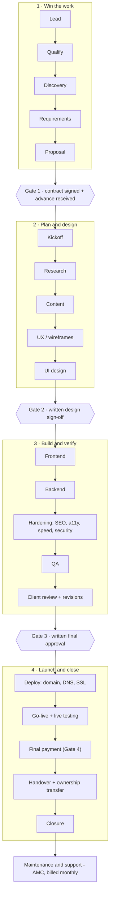

# Website Project Lifecycle & Operations SOP — India

Sep 28, 2026 · @gohitha

## 1. Executive summary

A small Indian web studio wins or loses on five things that are not code: written scope, staged payments, client-owned accounts, a signed copyright assignment, and a documented handover. Get those right and most disputes never start.

**Companion files.** The full task library (343 tasks, 67 categories, all 19 requested fields plus default points) is in the spreadsheet `website-project-task-library.xlsx`. The app specification and JSON seed data for your contribution tracker are in the `contribution-app-spec` files. This doc is the SOP that ties them together.

**What changed recently and matters to you (verified September 2026)**

- **Income-tax Act, 2025 is in force from 1 April 2026.** Clients now deduct TDS on your fees under section 393(1) (the old section 194J), still 10% for professional and 2% for technical services, with a ₹50,000 threshold. Update invoice notes and ask your CA which rate applies to website work.
- **DPDP Rules, 2025 were notified on 13–14 November 2025.** Most obligations (notice, consent, security safeguards, breach notification) apply from **13 May 2027**. Websites you build now will be live when that date arrives, so build forms and analytics to be ready.
- **GST on website development stays at 18%** (SAC 998314) after the September 2025 rate reform. Registration is required once aggregate turnover crosses ₹20 lakh (₹10 lakh in some special-category states).
- **Accessibility rules are tightening.** Draft RPwD (Amendment) Rules, 2026 were published in July 2026 and propose accessibility conformance reports for websites. Build to WCAG 2.2 AA by default.
- **OWASP Top 10:2025** is the current security baseline; misconfiguration and software supply chain are now #2 and #3.

**The ten rules this SOP enforces**

1. Nothing starts without a signed contract and a confirmed advance.
2. Every client account (domain, hosting, analytics, payment gateway) is created in the client's name, with you invited as a user.
3. Scope lists exclusions, revision rounds and client duties, not just deliverables.
4. Every change after sign-off goes through a written change request with a price.
5. Decisions live in email or the app; WhatsApp is for coordination.
6. Credentials live in a password manager, never in chat.
7. Copyright transfer is a signed written assignment that states duration and territory.
8. Handover ends with credential rotation and removal of your access, confirmed in writing.
9. Contribution points are agreed before work starts and locked at closure.
10. Anything legal or tax-related below is research, not advice: review it once with an Indian lawyer and a CA, then reuse.

**How to read the tags.** \[MUST HAVE\] = operationally essential. \[RECOMMENDED\] = strong practice. \[OPTIONAL\] = nice to have. \[CONDITIONAL\] = only if that feature exists. \[POST-LAUNCH\] = after go-live. A tag describes practice; legal status is stated separately in Section 5 with its source.

## 2. Lifecycle diagram and step-by-step workflow

The project runs through four phases separated by four hard gates: signed contract plus advance, design sign-off, final approval, and final payment. Ownership moves to the client only after gate 4.



Final payment (highlighted) sits before handover so ownership transfer is never used as leverage in reverse.

### The 44-step workflow (Part 14, with missing steps added)

Task IDs refer to the spreadsheet.

1. **Lead captured** and logged with source (A-03).
2. **First contact** made and logged (B-02).
3. **Qualification call**: need, decision-maker, budget, timeline (C-01).
4. **Risk check and go/no-go** recorded with reason (C-02, C-05).
5. **Discovery questionnaire** sent (D-01).
6. **Discovery meeting** held (D-02).
7. **Existing accounts audit**: who owns the domain, hosting, email today (D-05).
8. **Discovery summary** sent for client correction (D-03).
9. **Requirements**: goals, sitemap, features, content matrix, integrations, non-functional targets (E-01 to E-06).
10. **Requirements sign-off** in writing (E-07).
11. **Scope**: inclusions, exclusions, assumptions, revision rounds, client duties, milestones (F-01 to F-05).
12. **Estimate and price**, including third-party costs and GST (G-01, G-02).
13. **Proposal and quotation** sent with validity date (G-03, G-04).
14. **Negotiation** by changing scope, not only price (C-04, G-06).
15. **Contract**: master terms plus statement of work, IP and data terms (H-01 to H-04).
16. **Contract signed**; stamp duty checked (H-05, H-06).
17. **Advance invoice** raised and **payment confirmed in bank** — Gate 1 (I-01, I-02).
18. **Project setup**: record, folders, board, repo, staging, vault (J-01 to J-06).
19. **Internal kickoff**: owners and points locked by both partners (J-08).
20. **Client kickoff** with written notes (J-07).
21. **Client creates accounts** in their own name: domain, hosting, analytics, gateway (AA-01, AV-01, AX-02, AJ-01).
22. **Research**: audience, keywords, competitors, stack decision, legal-content list (L, M).
23. **Content collection** with deadlines and delay log (O-01 to O-06).
24. **Copywriting** if in scope; content approved in writing (P).
25. **UX**: flows, navigation, page hierarchy (Q).
26. **Wireframes** reviewed (R).
27. **UI design and design system** (S, T).
28. **Design sign-off** in writing — Gate 2 (U-04).
29. **Milestone invoice** if the contract links one to design (I-03).
30. **Frontend, backend, database, integrations, forms, email, CMS** built (V to AE).
31. **Conditional modules**: e-commerce, booking, payments, multilingual (AF, AG, AH, BM).
32. **SEO, analytics, accessibility, performance, security** implemented (AI to AM).
33. **Internal QA**: responsive, cross-browser, functional, content, security; bugs fixed and verified (AN to AQ).
34. **Client review on staging** with UAT script (AP-05, AR-01).
35. **Feedback classified**: bug, revision, or change request (AR-03).
36. **Revision rounds** delivered; change requests priced and approved (AS, AT).
37. **Final approval** in writing and launch window agreed — Gate 3 (BA-02).
38. **Pre-launch checklist** run (BA-01).
39. **Deploy, DNS cutover, HTTPS** (AU, AW, AY).
40. **Production testing**: smoke, live forms, emails, payments, indexing (BB-01 to BB-03).
41. **Final invoice** and **payment confirmed** — Gate 4 (BF-01, BF-02).
42. **Handover meeting, documentation, training**; handover acknowledgement signed (BC, BD, BE).
43. **Ownership transfer**: accounts, repository, copyright assignment, credential rotation, developer access removed; confirmation signed (BG-01 to BG-09).
44. **Closure**: retrospective, contribution sign-off, profit distribution, archive, testimonial; then **maintenance** under a separate AMC if agreed (BJ, BH).

If the client has already paid for their own domain and hosting (step 21), the ownership transfer at step 43 is mostly removing your access. That is the safest pattern and the one this SOP assumes.

## 3. Phase-by-phase explanation

For a typical 5–8 page local-business site, expect 4–8 weeks end to end, of which 1–3 weeks is usually waiting for client content and approvals. Durations below are planning ranges from common practice, not measured benchmarks; replace them with your own data after 5–10 projects.

### Phase 1 — Win the work (Lead → Proposal)

**Objective:** turn a prospect into a signed, paid-up client with a written scope. **Typical time:** 1–3 weeks.

- **Lead generation and outreach** \[RECOMMENDED\]: niche prospect list, a short audit of each prospect's current presence, personalised first message, capped follow-ups. Log every lead with source, because lead credit is a common partner dispute.
- **Qualification** \[MUST HAVE\]: confirm need, decision-maker, budget band, timeline and red flags before investing in discovery.
- **Discovery** \[MUST HAVE\]: questionnaire first, then a 60–90 minute meeting, then a written summary the client corrects. Audit who currently owns the domain, hosting and email; this is where launch blockers hide.
- **Requirements and scope** \[MUST HAVE\]: goals, sitemap, feature list with priorities, content responsibility matrix, integrations, non-functional targets (browsers, accessibility, performance). Then inclusions, exclusions, assumptions, revision rounds, client duties, milestones and acceptance criteria.
- **Proposal and quotation** \[MUST HAVE\]: bottom-up estimate from the task library, price including third-party costs and GST treatment, payment schedule, ownership model, validity date.
- **Gate 1:** signed contract and advance credited to the bank account.

### Phase 2 — Plan and design (Kickoff → Design sign-off)

**Objective:** agree what the site says and looks like before code. **Typical time:** 1–3 weeks.

- **Project setup** \[MUST HAVE\]: project record, standard folders, task board seeded from the library, repository, protected staging, credential vault, and the internal points lock (both partners confirm owners and default points).
- **Kickoff** \[MUST HAVE\]: timeline, content deadlines, communication rules, who approves what. The client creates their own accounts (domain, hosting, analytics, gateway) and invites you.
- **Research** \[RECOMMENDED\]: audience, keywords, competitors, technical stack decision, and a list of legal pages the client must supply.
- **Content** \[MUST HAVE\]: checklist with deadlines, collection in one folder, rights and consent checks for images, optimisation, and a delay log. Copywriting is a separate paid item unless the proposal includes it.
- **UX, wireframes, UI, design system**: flows and navigation, grey-box wireframes, then high-fidelity mobile and desktop designs with all component states and an accessibility check.
- **Gate 2:** written design sign-off. Visual changes after this are change requests.

### Phase 3 — Build and verify (Development → Client review)

**Objective:** a working, tested site on staging that matches the approved design and scope. **Typical time:** 2–4 weeks.

- **Frontend** \[MUST HAVE\]: broken into 25 tasks in the library (V-01 to V-25), from scaffold and tokens to mobile navigation, forms, validation, loading and error states, 404 page and favicons.
- **Backend, database, auth, APIs** \[CONDITIONAL\]: only when the site needs dynamic data. Many brochure sites need only a form handler.
- **Integrations, forms, email, CMS, admin** \[CONDITIONAL/MUST HAVE for forms\]: every third-party account in the client's name; SPF, DKIM and DMARC for any sending domain; spam protection without inaccessible CAPTCHAs.
- **E-commerce, booking, payments, multilingual** \[CONDITIONAL\]: priced as separate modules.
- **Hardening** \[MUST HAVE\]: SEO basics, analytics, accessibility to WCAG 2.2 AA, performance budget, security review against OWASP Top 10:2025.
- **QA and bug fixing** \[MUST HAVE\]: the partner who did not build a feature tests it where possible.
- **Client review and revisions** \[MUST HAVE\]: guided staging walkthrough, one consolidated feedback list per round, each item classified as bug (free), revision (counts toward rounds) or change request (priced).
- **Gate 3:** written final approval and an agreed launch window.

### Phase 4 — Launch and close (Deploy → Maintenance)

**Objective:** live site, paid invoice, client in full control, partners paid fairly. **Typical time:** 1–2 weeks.

- **Deploy, domain, DNS, hosting, HTTPS** \[MUST HAVE\]: export existing DNS before touching it, lower TTL a day ahead, avoid Friday-evening and festival launches.
- **Production testing** \[MUST HAVE\]: smoke test, real form submissions, real email delivery, a small live payment and refund if applicable, indexing check.
- **Gate 4 — final payment** \[MUST HAVE\]: confirmed bank credit before ownership transfer.
- **Handover, documentation, training** \[MUST HAVE\]: README, client user guide, account register, licence register, recorded training.
- **Ownership transfer** \[MUST HAVE\]: accounts confirmed in client's name, repository transferred, signed copyright assignment, credentials rotated, your access removed or reduced, confirmation signed.
- **Closure** \[MUST HAVE\]: retrospective, contribution lock, profit distribution, archive, testimonial request.
- **Maintenance** \[POST-LAUNCH\]: separate AMC with defined hours, response times and exclusions.

### Client communication types (Part 4)

Rule for contribution: a communication counts only if it has a record (notes or summary) and at least one follow-up task or decision. It earns fixed points per event, not hours, and communication is capped at 20% of a project's points (Section 11).

| Communication | Purpose | Document | Who attends | Evidence to store | Counts toward contribution? | Follow-up tasks |
| --- | --- | --- | --- | --- | --- | --- |
| Initial phone call | Qualify interest, book discovery | Need, budget band, timeline, decision-maker | One partner | Call log entry | Yes, 1 point if logged | Send questionnaire, go/no-go |
| Discovery call | Gather requirements | Goals, pages, features, accounts, content owner, constraints | Both partners if possible; client decision-maker | Notes, recording (with consent), summary email | Yes, 2–3 points each attendee who contributes | Discovery summary, requirements draft |
| Video meeting (general) | Any structured discussion | Agenda, decisions, actions | As needed | Notes + attendee list | Yes, per meeting type | Actions with owners and dates |
| Design discussion | Present and explain designs | Feedback items, approvals | Designer + PM role | Notes, feedback list | Yes, 1–2 points | Revision tasks or sign-off |
| Requirements clarification | Resolve an open question | The question, answer, who decided | Whoever asked | Email or app decision entry | Yes, 1 point only if it changes a requirement | Update requirements, decision log |
| Progress update | Keep client informed | Done, next, blockers, client actions pending | PM role | Sent message | Yes, 1 point per week | Chase blockers |
| Feedback call | Walk through staging feedback | Each item with page and screenshot | PM + builder | Consolidated feedback list | Yes, 1–2 points | Classify: bug, revision, change |
| Revision discussion | Agree what a round covers | Items in scope for the round | PM + builder | Round summary | Yes, 1 point | Revision tasks, round counter |
| Scope-change discussion | Evaluate a new request | Request, impact, price, timeline | PM + estimator | Change request form | Yes, 1–2 points | Impact estimate, approval, invoice |
| Pricing negotiation | Agree price and scope | Every concession and what scope changed | Sales role | Revised proposal version | Yes, 2 points | Revise proposal |
| Payment follow-up | Collect overdue amounts | Invoice, due date, promise-to-pay date | PM/finance role | Reminder log | Yes, 1 point per escalation step | Next reminder, pause work if contract allows |
| Deployment discussion | Agree launch window and DNS access | Date, time, who changes DNS, rollback plan | DevOps role + client IT if any | Launch plan note | Yes, 1 point | Pre-launch checklist |
| Final approval | Obtain written go-live approval | Approval text, date, approver | PM role | Signed approval or email | Yes, 1 point | Launch, final invoice |
| Handover meeting | Transfer knowledge and access | Items handed over, questions, open issues | Both partners ideally | Notes, signed acknowledgement | Yes, 2 points | Ownership transfer tasks, training follow-up |
| Post-launch support | Handle issues | Ticket, classification, resolution | Whoever resolves | Ticket record | Yes, via the ticket's task points | Fix, bill, or close |

### Channel best practices

- **Email** — the channel of record. Use it for proposals, approvals, scope changes, invoices and handover. One topic per thread; clear subject lines (“\[Project\] Design approval — round 2”). End decision emails with “Please reply ‘Approved’ to confirm.”
- **Phone** — fast for clarification, poor as evidence. After any call that decides something, send a two-line summary within 24 hours: “As discussed, we agreed X. Please correct me if I misunderstood.”
- **WhatsApp** — widely used in India and fine for coordination and quick questions. Create one group per project with the SPOC and both partners. Do not treat voice notes as approvals, never share passwords or API keys there, and copy any decision into email or the app. For bulk outreach, respect WhatsApp's business messaging rules; mass unsolicited messages can get a number restricted.
- **Video calls** — use for discovery, design reviews, UAT walkthroughs and handover. Send an agenda; ask permission before recording; share screen on staging, not on production.
- **In-person meetings** — good for first meetings with local businesses and for training. Carry a printed or tablet agenda, take notes live, and email the summary the same day.
- **Working hours and response times** — state them in the kickoff notes (for example, replies within one working day, Monday–Saturday). This protects both partners from late-night demands.

### Client discovery questionnaire (Part 5)

Send it before the discovery meeting; fill gaps on the call. Questions marked ★ prevent scope disputes later — never skip them.

**Business information**

- Legal business name, trading name, and business type (proprietorship, partnership, LLP, company)? ★
- GSTIN, if registered, and billing address for invoices? ★
- What do you sell, to whom, and where (city, pincode radius, pan-India, export)?
- Opening hours, branches, and service areas?
- Who is the decision-maker for design, content and payment? Who is the day-to-day contact? ★

**Brand**

- Do you have a logo in vector format (SVG, AI, PDF)? A brand guide, colours, fonts? ★
- Who designed the logo, and do you own its copyright? ★
- Words that should describe your brand? Words that should not?

**Target audience**

- Who are your top 2–3 customer types? Age, language, device, how they find you today?
- What questions do customers ask before buying or visiting?

**Goals**

- What should the site achieve in 6 months? (calls, WhatsApp chats, enquiries, bookings, sales) ★
- How will you measure success? Do you currently track enquiries by source?

**Pages**

- Which pages do you expect? Mark each: must-have, nice-to-have. ★
- Roughly how many services, products, locations or team members need their own page? ★
- Do you need a blog or news section? Who will write posts, and how often?

**Features**

- Contact form, WhatsApp button, click-to-call, map, gallery, testimonials, FAQs, downloads, newsletter signup?
- Anything that needs login, payments, booking, search or filters? ★

**Content**

- Who writes the text for each page — you, us (paid add-on), or a copywriter? ★
- By what date can you deliver all content? What happens if content is late? ★
- Existing website content we can reuse? Any claims that need proof (awards, certifications, registrations)?

**Images and videos**

- Do you have professional photos? Who took them, and do you have rights to use them online? ★
- Photos of customers or staff: do you have their consent to publish? ★
- Stock images: who pays for licences? Videos: hosted on YouTube/Vimeo or self-hosted?

**Products and services**

- Full list with prices (inclusive or exclusive of GST), variants, and how often they change?
- For e-commerce: number of SKUs, shipping regions, COD, return and refund policy owner? ★

**Contact information**

- Exact phone numbers, WhatsApp number, email addresses, address and map pin as they should appear?
- Where should form enquiries go (email, WhatsApp, CRM, Google Sheet)?

**Social media**

- Which profiles exist, and who controls their logins?
- Do you want feeds embedded or just links?

**SEO**

- Main services and areas you want to be found for?
- Do you have a Google Business Profile? Who owns and manages it? ★
- Is there an existing site with rankings or URLs we must redirect? ★
- Are you expecting guaranteed rankings? (We do not guarantee rankings.) ★

**Competitors**

- 3–5 competitors, and what you think they do better or worse?

**Design preferences**

- 3 websites you like and why; 2 you dislike and why?
- Light or dark, minimal or rich, playful or formal?

**Mobile**

- What share of your customers use phones? Any must-work devices (e.g., older Android phones)?

**Accessibility**

- Any customers or staff with disabilities who use the site? Any regulator or partner requiring an accessibility standard? ★

**Languages**

- Which languages? Who translates and who checks translations? Separate pages per language or a switcher? ★

**Integrations**

- Existing tools: CRM, accounting, booking, WhatsApp Business, email marketing, POS? Who owns those accounts? ★

**Forms**

- Which fields do you actually need? Do you need to store submissions, or only receive emails?
- Who reads the enquiries and how quickly will they respond?

**Booking**

- What is booked (appointments, tables, rooms, classes)? Durations, staff, deposits, cancellations? ★

**Payments**

- Do you have a payment gateway account? If not, can you complete merchant KYC in your business name? ★
- Refunds, partial payments, invoices with GST? ★

**Authentication**

- Does anyone need to log in (customers, staff, members)? What can each role see or change? ★

**CMS**

- What will you edit yourselves, how often, and who will do it? Comfortable with a simple editor? ★

**Admin**

- Do you need a dashboard for enquiries, orders, bookings or exports? Who needs access? ★

**Analytics**

- Do you have a Google account for the business (not a personal one) to own analytics and Search Console? ★

**Hosting**

- Existing hosting provider and plan? Who pays the bill? Any preference or budget limit for renewals? ★

**Domain**

- Do you already own the domain? Which registrar, in whose name, and who has the login? When does it expire? ★

**Email**

- Do you use business email on this domain (Google Workspace, Microsoft 365, host email)? Who manages it? ★

**Maintenance**

- After launch, who handles updates, backups, security and content changes? Do you want a monthly maintenance plan? ★

**Timeline**

- Target launch date and why (event, season, festival)? Any hard deadline? ★
- Holidays or busy periods when you cannot review?

**Budget**

- Budget range for the build, and for yearly running costs (domain, hosting, licences)? ★
- Payment schedule preference; will you deduct TDS? ★

**Future plans**

- What might you add in 12–24 months (shop, booking, app, new branches)? Should we design for that now?

### Scope management (Part 6)

| Element | How to define it | Example wording |
| --- | --- | --- |
| Included work | Countable nouns: pages, templates, forms, integrations, rounds, training hours | “6 pages built from 3 templates; 1 contact form; 2 design revision rounds” |
| Excluded work | Name the common assumptions explicitly | “Copywriting, logo design, photography, paid ads, product entry beyond 20 items” |
| Assumptions | Conditions your price depends on | “All content supplied by 15 Oct; one decision-maker gives consolidated feedback” |
| Deliverables | What the client receives at the end | “Live site, source code repository, README, user guide, account register” |
| Milestones | Checkpoints with acceptance criteria | “Design approved; staging passes UAT script; site live” |
| Deadlines | Dates tied to client inputs | “Launch 10 working days after final content and approval” |
| Revisions | Rounds per stage and what a round is | “A round = one consolidated list from the decision-maker” |
| Client responsibilities | Content, approvals, accounts, payments, response times | “Approvals within 3 working days; delays extend the timeline day for day” |
| Developer responsibilities | Build, test, deploy, document, hand over, warranty | “Fix defects reported within 30 days of launch” |
| Third-party dependencies | Services and their owners and costs | “Hosting, domain, gateway fees are paid by the client directly” |
| Scope changes | The change-request process below | “Work outside this scope follows the change request process” |

### Scope change request workflow

1. **Capture** — log the request in the app (AT-01): what, why, who asked, date. Reply: “Thanks, I've logged this. I'll send the impact by \[date\].”
2. **Classify** — bug in agreed scope (free), included revision (uses a round), or change (new work).
3. **Assess** — estimate hours with the task library, cost, timeline shift, and risk to launch (AT-02).
4. **Quote** — send a one-page change request: description, price, new dates, and effect on other deliverables.
5. **Approve** — client replies “Approved” or signs (AT-03). No approval, no work.
6. **Schedule and invoice** — add tasks to the board with points, add the amount to the next invoice or bill it upfront.
7. **Record** — update scope version, decision log and timeline.

**When the client says “Can you also add this one small feature?”**

- Do not say yes or no on the spot. Say: “Happy to look at it. I'll check the effort and come back with the cost and any effect on the launch date.”
- If it truly takes under 30 minutes and does not touch the timeline, you may include it as a goodwill item — but still log it as a change request marked “no charge” and cap goodwill at a stated amount (for example, 2 hours per project). This keeps a record and stops “small” requests compounding.
- Otherwise price it: hours × your rate, rounded up to a minimum charge (for example, 1 hour), plus any third-party cost, plus timeline impact. Offer alternatives: add it after launch as phase 2, or swap it for an included item of similar effort.
- Log it in the app with points for the partner who assessed and the partner who builds it. The assessment earns points even if the client declines.

## 4. Master task library

The library holds 343 tasks in 67 categories: your 62 requested categories plus 5 that the research showed were missing (legal and compliance pages, backup and recovery, localisation, internal finance and tax admin, partner governance). 225 tasks belong in a standard brochure-site project and carry about 349 default points; the rest are conditional modules or business-level work.

**Where it lives.** `website-project-task-library.xlsx` has three working sheets: *Task Library* (all 19 requested fields plus default points), *Contribution Library* (the exact Part 13 columns) and *Category Summary* (live counts and points by category). The same data is in `seed_tasks.json` for the app.

**How it is classified.** 179 tasks are \[MUST HAVE\], 73 \[RECOMMENDED\], 72 \[CONDITIONAL\], 11 \[OPTIONAL\], 8 \[POST-LAUNCH\]. 297 are included in the base price, 33 are separate billable items and 13 depend on the proposal.

**Category coverage (task count):** A Lead Generation (4) · B Client Outreach (4) · C Sales (5) · D Discovery (5) · E Requirements (7) · F Scope (5) · G Proposal/Quotation (6) · H Contract (6) · I Payment/Invoice (6) · J Project Setup (8) · K Client Communication (5) · L Research (5) · M Competitor Research (3) · N Brand Assets (4) · O Content Collection (6) · P Copywriting (6) · Q UX (4) · R Wireframes (3) · S UI Design (6) · T Design System (5) · U Design Approval (4) · V Frontend (25) · W Backend (10) · X Database (7) · Y Authentication (6) · Z APIs (3) · AA Integrations (6) · AB Forms (6) · AC Email (5) · AD CMS (5) · AE Admin Dashboard (4) · AF E-commerce (7) · AG Booking (4) · AH Payments (5) · AI SEO (11) · AJ Analytics (4) · AK Accessibility (8) · AL Performance (7) · AM Security (9) · AN Responsive (3) · AO Cross-browser (3) · AP QA (5) · AQ Bug Fixing (3) · AR Client Review (3) · AS Revisions (3) · AT Scope Changes (3) · AU Deployment (4) · AV Domain (3) · AW DNS (3) · AX Hosting (3) · AY SSL/HTTPS (3) · AZ Production Environment (4) · BA Launch (5) · BB Post-launch Testing (4) · BC Handover (3) · BD Documentation (4) · BE Training (2) · BF Final Payment (3) · BG Ownership Transfer (9) · BH Maintenance (6) · BI Support (3) · BJ Closure (6) · BK Legal pages (5) · BL Backup (3) · BM Localisation (3) · BN Finance admin (3) · BO Partner governance (2).

### What one fully specified task looks like

| Field | V-09 Responsive mobile navigation | BG-03 Repository transfer |
| --- | --- | --- |
| Category | V Frontend Development | BG Ownership Transfer |
| Description | Accessible menu toggle (a real button with aria-expanded), focus management, close on Escape, scroll lock | Transfer repo to client's organisation or account, or deliver a full archive; confirm client is admin; remove developer collaborator if not maintaining |
| Why | Most local-business traffic is mobile | Client owns the source code |
| When | Development | Ownership transfer, after final payment |
| Prerequisites | V-08 header | BF-02 final payment, BD-01 README |
| Owner | FE | FE/BE |
| Deliverable | Mobile navigation component | Repository under client ownership |
| Evidence | Commit + device screenshots | Repo settings screenshot showing owner and collaborators |
| Client approval | No | Yes |
| Classification | \[MUST HAVE\] | \[MUST HAVE\] |
| Complexity / effort | Medium / 2–4 h | Low / 0.5–1 h |
| Default points | 4 | 1 |
| Risks | Keyboard traps | Developer silently retained as collaborator |
| Common mistakes | A div used as a button; no Escape close | Assuming transfer removes your access |
| If skipped | Unusable on phones and for keyboard users | Unintended developer access to client code |
| Standard project | Yes | Yes |
| Separate billable | No | No |
| Maintenance | No | No |

The second example matters: GitHub's documentation notes that when a repository moves between personal accounts, the original owner and collaborators are added as collaborators on the transferred repository, so removal is a separate, deliberate step ([GitHub Docs](https://docs.github.com/en/repositories/creating-and-managing-repositories/transferring-a-repository)).

### How to customise defaults

- **Points formula.** Default points ≈ midpoint of the effort range in hours × complexity factor (Low 1.0, Medium 1.25, High 1.5), rounded, minimum 1. Per-page or per-item tasks show points per unit; multiply by quantity at planning.
- **Per project.** At kickoff (J-08) delete tasks that do not apply, set quantities, and lock the plan. Overrides need both partners and a reason.
- **Across projects.** Every quarter (BO-02) compare planned points with actual hours by category. If a category is consistently 30% over, raise its defaults for future projects only.
- **Your stack.** A WordPress studio will collapse backend tasks into CMS tasks; a static-site studio will drop most of W, X, Y and Z. Edit the library once for your stack rather than on every project.

## 5. Indian legal and business considerations

Three legal facts shape almost everything else: copyright in your code stays with you until a signed written assignment moves it; an unregistered partnership firm cannot sue a client on its contracts; and personal data collected through client websites falls under the DPDP regime, with most duties live from 13 May 2027. This section is research, not legal advice. Status labels: **Required** (a statute imposes it when the condition applies), **Situation-dependent** (applies only in certain structures, sizes or features), **Recommended** (good practice, no statutory mandate found).

Items marked † cite the statute from general knowledge and were not re-verified against a primary text in this research pass; confirm them with your lawyer or CA before relying on them.

### 5.1 Business structure and registrations

| Topic | Plain meaning and why you care | Status | Source | Review with lawyer/CA |
| --- | --- | --- | --- | --- |
| Choice of structure | Two friends working together without any registration are usually treated as a partnership. Options: partnership (registered or not), LLP, private limited company. Each changes liability, tax, compliance and how profits reach you. | Situation-dependent | Indian Partnership Act 1932; LLP Act 2008†; Companies Act 2013† | Which structure fits your revenue, risk and growth plans |
| Partnership deed | A written deed records capital, profit-sharing method, roles, exit and dispute rules. Your contribution app should implement exactly what the deed says. | Recommended (strongly) | Indian Partnership Act 1932† | Draft the deed; reference the contribution framework in it |
| Registering the firm | An unregistered firm cannot sue a third party to enforce a contract, and partners of an unregistered firm cannot sue each other or the firm on contractual rights. That blocks fee recovery in court. | Situation-dependent (registration is optional, but consequences are real) | Section 69, Indian Partnership Act ([Indian Kanoon](https://indiankanoon.org/doc/797638/)); consequences discussed by [Vakilsearch](https://vakilsearch.com/article/effect-and-consequences-of-non-registration-of-partnership-firm/) | Register with the state Registrar of Firms; whether arbitration is affected is a debated point |
| GST registration | Service providers must register once aggregate turnover exceeds ₹20 lakh (₹10 lakh in some special-category states). Small service providers making inter-state supplies are exempt from compulsory registration below that threshold. | Required above threshold | [GST Council flyer on registration](https://gstcouncil.gov.in/sites/default/files/e-version-gst-flyers/Registration_under_GST_Law_new.pdf); Notification 10/2017-Integrated Tax ([summary](https://gstindia.biz/notification/535/exempts-persons-making-inter-state-supplies-of-taxable-services-from-registration-subject-to-turnover-limits)) | Whether voluntary registration helps (B2B clients want input tax credit); state-specific threshold |
| GST rate and SAC | Website design and development is generally classified under SAC 998314 at 18%; hosting resold may fall under 998315. Rates for IT services did not change in the September 2025 reform. | Required if registered | [Busy](https://busy.in/gst-rates/it-services/); [RegisterKaro](https://www.registerkaro.in/post/gst-registration-for-software-it-services) | Correct SAC for maintenance, hosting resale and domain pass-through |
| Exports of services | Work for foreign clients can be zero-rated if exported under a Letter of Undertaking. | Situation-dependent | [RegisterKaro](https://www.registerkaro.in/post/gst-registration-for-software-it-services) | Export conditions, foreign-currency receipt, LUT filing |
| Udyam (MSME) registration | Free registration that unlocks the MSMED Act's delayed-payment protection for micro and small enterprises. | Recommended | [MSME West Bengal FAQ](https://msme.wb.gov.in/faq) | Current micro/small thresholds; register the right entity |
| State registrations | Shops and establishments registration and professional tax are state laws and may apply once you have premises or staff. | Situation-dependent | Telangana/your state's Shops and Establishments Act† | What your state requires for a two-person office or home office |

### 5.2 Tax on your income and invoices

| Topic | Plain meaning and why you care | Status | Source | Review with lawyer/CA |
| --- | --- | --- | --- | --- |
| TDS deducted by clients | From 1 April 2026 the Income-tax Act, 2025 replaced the 1961 Act. TDS on professional and technical fees moved from section 194J to section 393(1): 10% for professional services, 2% for technical services, above ₹50,000 a year per payee. Business clients may deduct this from your invoices. | Required (on the client, when applicable) | [TDSMAN](https://blog.tdsman.com/2026/07/tds-on-fees-for-professional-and-technical-services-section-3931-194j/); [Keka](https://www.keka.com/section-194j-tds) | Whether web development is “professional” or “technical” for your invoices; reconciling credits in AIS/26AS |
| TDS on partner payments | Partnership firms paying remuneration, commission or interest to partners have a TDS obligation (the former section 194T, now within section 393). | Situation-dependent (firms) | [TaxGarden rate chart](https://taxgarden.in/blog/tds-rate-chart-2026-to-2027) | How partner remuneration and profit share are taxed and documented |
| Tax invoices | If GST-registered, invoices must carry prescribed particulars (GSTIN, SAC, taxable value, rate, tax, place of supply). Intra-state supplies carry CGST + SGST; inter-state carry IGST. | Required if registered | CGST Rules, rule 46† | Invoice template, numbering series, e-invoicing thresholds |
| Quotation vs invoice | A quotation or proposal is an offer, not a tax document. Keep quote numbers separate from invoice numbers. | Recommended | — | — |
| Record retention | GST-registered persons must keep books and records until 72 months after the due date of the annual return for that year (longer if under appeal or investigation). | Required if registered | [CGST Act s.36 (CBIC)](https://taxinformation.cbic.gov.in/content/html/tax_repository/gst/acts/2017_CGST_act/active/chapter8/section36_v1.00.html) | Income-tax retention for your structure; practical default of 8 years |
| Business bank account | A separate account for the business makes the profit split, GST and TDS reconciliation provable. | Recommended | — | Account type for your structure |

### 5.3 Contracts, payment and electronic signatures

| Topic | Plain meaning and why you care | Status | Source | Review with lawyer/CA |
| --- | --- | --- | --- | --- |
| Contract formation | A proposal accepted with consideration between competent parties is a contract. A WhatsApp “ok go ahead” can form one, but proving the terms is hard. | Required elements, by law | Indian Contract Act 1872, ss.2 and 10† | Master services agreement template |
| Electronic contracts | A contract is not unenforceable merely because offer, acceptance or revocation happened electronically. Certain documents (e.g., powers of attorney, wills, trusts, immovable property sales) are excluded from electronic execution. | Required rule, general | [IT Act s.10A, India Code](<https://www.indiacode.nic.in/bitstream/123456789/1999/1/A2000-21%20(1).pdf>); exclusions summarised by [Mondaq](https://www.mondaq.com/india/contracts-and-commercial-law/971932/electronic-contracts-the-likely-new-normal39) | Which e-sign method to use (Aadhaar eSign or DSC are Second Schedule methods; simple click-to-sign relies on s.10A and evidence) |
| Electronic evidence | Emails, WhatsApp chats and PDFs can be evidence, but courts expect proper proof of electronic records under the Bharatiya Sakshya Adhiniyam, 2023. | Situation-dependent | Bharatiya Sakshya Adhiniyam 2023, s.63† | How to preserve chats and emails so they are admissible |
| Stamp duty | Agreements can attract state stamp duty. An unstamped or under-stamped agreement is inadmissible in evidence until duty and penalty are paid; a 7-judge Supreme Court bench held in December 2023 that this is a curable defect and does not make the agreement void. | Situation-dependent (state and instrument) | [Supreme Court, 2023 INSC 1066](https://api.sci.gov.in/supremecourt/2022/40099/40099_2022_1_1501_49105_Judgement_13-Dec-2023.pdf) | Duty for your state's service agreement article; e-stamping process |
| Advance and milestone payments | Nothing in general contract law requires advances; they are commercial terms you negotiate. | Recommended | — | Refundability wording for advances |
| Late payment (MSME) | If you are a Udyam-registered micro or small enterprise, a buyer must pay within the agreed period, which cannot exceed 45 days from acceptance of the service (15 days if nothing is agreed in writing). Late payment attracts compound interest at three times the RBI bank rate. Disputes can go to the MSME Facilitation Council. | Required when conditions apply | [MSME FAQ](https://msme.wb.gov.in/faq); [PDR Court guide](https://www.pdrcourt.com/guides/recover-msme-delayed-payments) | Whether individual or proprietor clients are “buyers”; current bank rate |
| Late-payment interest clause | For non-MSME cases, a contractual interest rate is a negotiated term. | Recommended | Indian Contract Act† | A reasonable rate that a court would uphold |
| Liquidated damages and penalties | Indian law awards reasonable compensation up to the amount named in the contract; a named figure is a ceiling, not automatic. Applies to delay penalties clients ask you to accept. | Situation-dependent | Indian Contract Act s.74† | Whether to accept delay penalties, and caps |
| Limitation of liability and indemnity | Caps (e.g., fees paid) and exclusions (indirect loss) are common but their enforceability depends on facts and fairness. Indemnities for client content and third-party claims are common. | Recommended | Indian Contract Act ss.73, 124† | Cap amount, carve-outs, mutuality |
| Warranties | State what you warrant (conformity with specification for a defect period) and what you do not (uninterrupted service, rankings, third-party uptime). | Recommended | — | Wording for disclaimers |
| Cancellation, termination, refunds | Define notice, payment for work done, what happens to advances and deliverables, and deemed acceptance. | Recommended | — | Whether a non-refundable advance clause is enforceable in your facts |
| Non-compete and non-solicit | Agreements restraining anyone from a lawful profession are generally void in India, with narrow exceptions. Broad client non-competes on you are likely unenforceable; staff non-solicit clauses are contested. | Required rule, general | Indian Contract Act s.27† | Any exclusivity a client asks for |
| Governing law and jurisdiction | Choose Indian law and courts of a named city (for example, Hyderabad). Parties can pick among courts that have jurisdiction; they cannot oust all courts. | Recommended | Indian Contract Act s.28† | City choice; interplay with arbitration clause |
| Arbitration and mediation | An arbitration clause lets disputes go to an arbitrator; for small disputes, costs can exceed the amount at stake. Commercial suits above a specified value generally need pre-institution mediation first. MSME suppliers also have the Facilitation Council route. | Situation-dependent | Arbitration and Conciliation Act 1996†; Commercial Courts Act 2015 s.12A† | Whether to include arbitration at your ticket sizes; seat and venue |
| Limitation period | Claims for unpaid fees must generally be filed within three years. | Required rule | Limitation Act 1963† | Exact start date for your invoices |
| Force majeure and frustration | Define events outside control; otherwise only the narrow statutory doctrine of frustration applies. | Recommended | Indian Contract Act s.56† | Wording |

### 5.4 Intellectual property

| Topic | Plain meaning and why you care | Status | Source | Review with lawyer/CA |
| --- | --- | --- | --- | --- |
| Who owns the code and design first | The author is the first owner of copyright. Computer programs are literary works. The employer exception covers employees under a contract of service, not independent studios. Commissioned photos and portraits have a separate rule favouring the commissioner. So by default, your studio (or the partner who wrote it) owns what you build. | Required rule | [Copyright Act s.17, India Code](https://www.indiacode.nic.in/bitstream/123456789/15356/1/the_copyright_act,_1957.pdf) | Who owns code between the two partners before the firm assigns it; a partner-to-firm assignment in the deed |
| Assigning copyright to the client | An assignment is valid only in writing signed by the assignor; it must identify the work and state the rights, duration and territory. If duration is silent, it is deemed five years; if territory is silent, India only. If the assignee does not exercise the rights within one year, the assignment may be deemed to lapse unless the deed says otherwise. Payment alone does not transfer copyright. | Required if you intend to transfer ownership | [Copyright Act s.19 (Indian Kanoon)](https://indiankanoon.org/doc/262036/); five-year default confirmed in Pine Labs v Gemalto (Delhi HC), summarised on [Wikipedia](https://en.wikipedia.org/wiki/Assignment_of_copyright_in_software_under_Indian_Copyright_Act) | Assignment deed wording (“perpetual, worldwide”), whether e-signatures satisfy “signed” for your method |
| Licence instead of assignment | You can keep ownership of reusable components (starter kits, your framework, snippets) and grant the client a perpetual, irrevocable licence to use them in their site. | Recommended | Copyright Act s.30† | Licence scope; the line between bespoke and reusable code |
| Moral rights | Authors keep rights to claim authorship and object to distortion even after assignment. | Required rule | Copyright Act s.57† | Waiver or consent wording, e.g., for credit links |
| Portfolio and credit link | Showing the work and a “designed by” footer link are contractual permissions, not automatic rights once you assign. | Recommended | — | Clause allowing portfolio use and removable credit |
| AI-assisted output | Copyright in AI-assisted or AI-generated material is legally unsettled in India. | Situation-dependent | Copyright Act s.2(d)(vi)† | Disclosure of AI use and warranties you can safely give |
| Third-party assets | Fonts, stock photos, icons, themes, plugins and videos are licensed, not owned. Web-font and desktop-font licences differ; many stock licences are per-project or per-seat; some themes require one licence per site. | Required (licence terms are contractual obligations) | Each vendor's licence | Whether licences must be in the client's name |
| Open-source software | Libraries come with licences (MIT, BSD, Apache 2.0, GPL, AGPL). Permissive licences need attribution; copyleft licences can require sharing source in some distribution or network scenarios. | Required (licence compliance) | Each package's licence | Any GPL/AGPL component in a client deliverable |
| Client-provided content | The client must have rights to what they send (text, logos, photos, testimonials). You need a warranty and indemnity from them. | Recommended | — | Indemnity scope |
| Trademarks | Logo and brand name rights are trademarks, separate from copyright. A logo you design can infringe someone's mark. | Situation-dependent | Trade Marks Act 1999† | Pre-launch search for logo work |

### 5.5 Personal data, privacy and security

| Topic | Plain meaning and why you care | Status | Source | Review with lawyer/CA |
| --- | --- | --- | --- | --- |
| DPDP Act and Rules | The Digital Personal Data Protection Rules, 2025 were notified in November 2025 with an 18-month phase-in. Consent Manager provisions start around 13 November 2026; notice, consent, security safeguards, breach notification, rights and penalties apply from 13 May 2027. Your client is usually the Data Fiduciary for their website's contact forms and analytics. | Required (phased) | [PIB factsheet](https://static.pib.gov.in/WriteReadData/specificdocs/documents/2025/nov/doc20251117695301.pdf); [Legal500 timeline](https://www.legal500.com/intelligence/india/privacy/india's-digital-personal-data-protection-act-and-the-dpdp-rules-2025-phased-commencement-core-obligations-and-a-board-ready-compliance-strategy) | Exact dates in your client's case; whether any client is a Significant Data Fiduciary |
| Proposed acceleration | In January 2026 MeitY proposed compressing the timeline for Significant Data Fiduciaries to 12 months. As of July 2026 this was reported as a proposal, not a notified change; small local businesses are unlikely to be Significant Data Fiduciaries. | Situation-dependent (watch) | [S.S. Rana](https://ssrana.in/articles/meity-plans-to-cut-short-dpdp-compliance-timeline-and-notify-cross-border-restrictions-for-sdfs/); [Pyroniq, verified 22 Jul 2026](https://www.pyroniq.ai/resources/dpdpa-compliance-timeline) | Status at contract time |
| You as Data Processor | If you host forms, store enquiries or have admin access, you process personal data on the client's behalf. The Act keeps the fiduciary responsible and expects processors to be engaged under a valid contract. | Required for the client; relevant to your contract | [Legal500 summary of s.8](https://www.legal500.com/intelligence/india/privacy/india's-digital-personal-data-protection-act-and-the-dpdp-rules-2025-phased-commencement-core-obligations-and-a-board-ready-compliance-strategy) | A processing clause: purpose, security, deletion at end, breach notice to client |
| Forms and notices | Collect only needed fields; show a short notice with a link to the privacy notice; use a separate unticked box for marketing. | Required from May 2027 for fiduciaries; recommended now | DPDP Act ss.5–6 via [PIB factsheet](https://static.pib.gov.in/WriteReadData/specificdocs/documents/2025/nov/doc20251117695301.pdf) | Notice text (client's lawyer) |
| Cookies and analytics | India has no cookie-specific statute; analytics that process personal data fall under the general DPDP notice and consent framework. A consent banner is a design choice to manage that risk. | Situation-dependent | DPDP Act† | Whether your clients need consent-gated analytics |
| Breach notification | Under the Rules, fiduciaries must inform affected individuals and the Data Protection Board of personal data breaches. | Required (from May 2027) | [PIB factsheet](https://static.pib.gov.in/WriteReadData/specificdocs/documents/2025/nov/doc20251117695301.pdf) | Your duty to tell the client fast; timelines in your contract |
| IT Act s.43A and SPDI Rules | The older regime on “sensitive personal data” is replaced by the DPDP Act as its provisions commence. | Situation-dependent (transition) | IT Act 2000 s.43A; DPDP Act s.44† | Whether s.43A still applies on your contract date |
| CERT-In Directions (April 2022) | Require reporting certain cyber incidents to CERT-In within 6 hours and log retention, for listed entities including service providers and body corporates. How far this reaches a two-person studio is unclear. | Situation-dependent | CERT-In Directions under IT Act s.70B† | Whether and when you must report an incident on a site you host |
| Security responsibility | Define who patches, backs up, monitors and responds after handover. Without an AMC, it should be the client. | Recommended | — | Liability allocation |

### 5.6 Feature-specific rules for client sites

| Topic | Plain meaning and why you care | Status | Source | Review with lawyer/CA |
| --- | --- | --- | --- | --- |
| E-commerce disclosures | E-commerce entities must display legal name, address, customer care and grievance officer details; acknowledge complaints within 48 hours and resolve within one month; not record consent through pre-ticked boxes; show return, refund, delivery and payment terms. Amendment Rules published in September 2026 add a dark-pattern self-audit requirement. | Required for e-commerce clients | [E-Commerce Rules 2020 (ICSI copy)](https://www.icsi.edu/media/webmodules/Consumer_Protection_E-Commerce_Rules_2020.pdf); [2026 amendment text](https://www.taxheal.com/consumer-protection-e-commerce-amendment-rules-2026-2.html) | Client's lawyer confirms policies; check the amendment's commencement date |
| Dark patterns | Guidelines for Prevention and Regulation of Dark Patterns, 2023 prohibit practices such as false urgency, basket sneaking and confirm-shaming. | Required for platforms in scope | Referenced in [2026 amendment](https://www.taxheal.com/consumer-protection-e-commerce-amendment-rules-2026-2.html) | Checkout and pop-up designs |
| Online payments | Use the gateway's hosted or tokenised checkout; do not store card data. RBI card-on-file tokenisation rules restrict merchants from storing card details. The merchant account and KYC belong to the client. | Required (card storage restriction) | RBI tokenisation directions† | Gateway agreement terms |
| Accessibility | RPwD Act ss.40, 42 and 46 and Rule 15 set accessibility duties for establishments, including private ones; the Chief Commissioner has penalised non-compliant websites. Draft RPwD (Amendment) Rules, 2026 (published July 2026) propose Accessibility Conformance Reports and IS 17802 compliance within 18 months for smaller establishments. | Situation-dependent, tightening | [AZB & Partners](https://www.azbpartners.com/bank/bridging-the-digital-divide-indias-evolving-accessibility-framework/); [draft 2026 Rules (Mondaq)](https://www.mondaq.com/india/compliance/1824050/the-new-accessibility-conformance-regime-key-takeaways-from-the-draft-rpwd-amendment-rules-2026) | Whether final rules are notified; what you warrant about accessibility |
| Regulated sectors | Clinics, schools, financial services, food businesses and others may have sector rules on advertising claims and disclosures. | Situation-dependent | Sector regulators | Client's own counsel supplies required disclosures |

### 5.7 What to get reviewed once, then reuse

- [ ] Partnership deed (or LLP agreement) including the contribution and profit-split method.
- [ ] Master services agreement plus statement-of-work template.
- [ ] Copyright assignment deed and licence for pre-existing components.
- [ ] Data processing schedule for projects where you touch personal data.
- [ ] Maintenance (AMC) agreement.
- [ ] Invoice template, GST position, TDS rate advice, and record-retention policy (CA).
- [ ] Stamp duty position for your state's service agreements.
- [ ] Accessibility warranty wording, updated when the 2026 draft Rules are finalised.

## 6. Terms and conditions checklist

These are the standard terms that sit behind every proposal and quotation, so a client who accepts a quote by email accepts them too. Attach them as a PDF or link and reference them in the quote: “This quotation is subject to our Standard Terms v1.0 (attached).”

**Offer and acceptance**

- [ ] Quote validity period (e.g., 15 days) and that prices exclude GST unless stated.
- [ ] How acceptance happens: signature, written “Approved”, or advance payment.
- [ ] Order of precedence: signed contract > statement of work > proposal > these terms.

**Scope and changes**

- [ ] Scope is only what the proposal lists; everything else is a change request.
- [ ] Revision rounds per stage and definition of a round.
- [ ] Change requests are quoted and approved in writing before work.
- [ ] Timeline depends on client inputs; delays extend dates day for day.
- [ ] Projects paused for more than N days by the client can be re-scheduled or invoiced for work done.

**Payment**

- [ ] Payment schedule (e.g., 40% advance, 30% on design approval, 30% before launch or handover).
- [ ] Payment due within N days of invoice (not more than 45 days of acceptance if you rely on MSMED protection).
- [ ] Interest on late payment and right to pause work after a stated notice.
- [ ] Third-party costs (domain, hosting, licences, gateway fees) are paid by the client directly or reimbursed with a handling fee.
- [ ] TDS: client provides TDS certificate for any deduction.

**Client responsibilities**

- [ ] Supply accurate content, images with rights, and timely approvals.
- [ ] Create and own third-party accounts; invite the studio as a user.
- [ ] Provide legal texts (privacy notice, terms, refund policy) or engage a lawyer.
- [ ] Single point of contact with authority to approve.

**Ownership and licences**

- [ ] Ownership of bespoke deliverables transfers by a signed assignment after full payment.
- [ ] Pre-existing and reusable studio components are licensed, not assigned.
- [ ] Third-party assets remain under their own licences.
- [ ] Portfolio use and an optional credit link.

**Warranty, support and liability**

- [ ] Defect warranty period (e.g., 30 days) and what it covers.
- [ ] No guarantee of search rankings, traffic, sales or third-party uptime.
- [ ] Limitation of liability (e.g., to fees paid for the project) and exclusion of indirect loss.
- [ ] Client indemnity for content and instructions they supply.
- [ ] Maintenance is a separate agreement.

**Termination and cancellation**

- [ ] Either party may terminate on written notice; client pays for work done to date.
- [ ] Advance treatment on cancellation (state clearly; get legal review of any “non-refundable” wording).
- [ ] Deliverables released only for work paid for.

**Confidentiality and data**

- [ ] Mutual confidentiality.
- [ ] Personal data handled only to deliver the service, deleted or returned at the end.

**Law and disputes**

- [ ] Indian law; courts at your city; optional mediation or arbitration step.
- [ ] Notices by email to named addresses count as written notice.
- [ ] Electronic acceptance and e-signatures are valid.

**Housekeeping**

- [ ] Version number and date on the terms; the version accepted is stored in the project record.

## 7. Client contract clause checklist

The master services agreement should contain the clauses below; the project-specific facts go in a statement-of-work schedule. “Legal note” flags where Indian law adds a condition or where enforceability is uncertain; do not treat any clause as valid just because it reads reasonably.

| # | Clause | What it should say | Legal note |
| --- | --- | --- | --- |
| 1 | Parties and authority | Legal names, addresses, GSTINs, signatory names and authority; your firm's registration details | Unregistered firms face suit restrictions (Partnership Act s.69) |
| 2 | Definitions | Deliverables, acceptance, business day, change request, round, defect, pre-existing materials, third-party materials | — |
| 3 | Scope and SOW | Incorporate the SOW schedule; order of precedence | — |
| 4 | Client obligations | Content, approvals within N days, account creation, SPOC, legal texts, lawful business | — |
| 5 | Timeline and delays | Dates depend on inputs; client delay extends timeline; long pauses allow re-scheduling or interim invoicing | Delay penalties on you are capped by s.74 principles † |
| 6 | Acceptance | Acceptance tests per milestone; deemed acceptance if no written defects within N days or on public launch | — |
| 7 | Revisions and change control | Rounds included; change requests in writing, priced, approved before work | — |
| 8 | Fees and payment | Amount, GST, schedule, due dates, payment method | MSMED 45-day ceiling if Udyam-registered |
| 9 | Late payment | Interest, reminder schedule, right to suspend work after notice | MSMED statutory interest may apply |
| 10 | Taxes | GST extra unless stated; TDS certificates; each party bears its own taxes | Section 393 TDS from April 2026 |
| 11 | Third-party services and costs | Client owns and pays hosting, domain, licences, gateways; studio not liable for their outages or price changes | — |
| 12 | Intellectual property — assignment | After full payment, studio assigns copyright in bespoke deliverables; states work, rights, **perpetual** duration, **worldwide** territory, consideration; signed | Copyright Act s.19; silence defaults to 5 years / India |
| 13 | IP — pre-existing materials | Studio keeps ownership; grants client a non-exclusive, perpetual, irrevocable, royalty-free licence to use in the site | — |
| 14 | IP — third-party materials | Remain under their licences; licences in client's name where possible | — |
| 15 | Open source | Components under open-source licences are provided under those licences | Check copyleft obligations |
| 16 | Client content warranty | Client has rights to all content supplied; indemnifies studio for claims | — |
| 17 | Moral rights and credit | Portfolio use; optional credit link removable on request | Copyright Act s.57 † |
| 18 | Confidentiality | Mutual, with standard exclusions; survives termination for N years | — |
| 19 | Data protection | Studio processes personal data only on client's instructions to deliver the service; security measures; breach notice to client within N hours; deletion or return at end | DPDP Act; processor must be under a valid contract |
| 20 | Security responsibilities | Studio builds to agreed standards; post-handover patching, backups and monitoring are the client's unless under AMC | — |
| 21 | Warranty | Deliverables materially conform to spec for a defect period; exclusive remedy is fixing defects | — |
| 22 | Disclaimers | No guarantee of rankings, traffic, sales, uninterrupted service, or third-party performance | — |
| 23 | Limitation of liability | Cap (e.g., fees paid), exclusion of indirect and consequential loss; carve-outs for fraud and IP indemnity if agreed | Enforceability fact-dependent † |
| 24 | Indemnities | Client: content and instructions; studio (optional, capped): IP infringement in bespoke code | — |
| 25 | Maintenance and support | Excluded unless a separate AMC is signed; warranty support only | — |
| 26 | Uptime | No uptime commitment unless the studio hosts under an AMC with a stated SLA | — |
| 27 | Accounts and access | Client owns all accounts; studio access is temporary and removed at handover unless AMC | — |
| 28 | Handover | List of handover items; handover acknowledgement; transfer only after full payment | — |
| 29 | Termination | For convenience with notice; for cause (non-payment, material breach) with cure period; effects: pay for work done, return materials, assignment only of paid work | — |
| 30 | Cancellation and advances | What happens to the advance at each stage | “Non-refundable” wording needs legal review |
| 31 | Non-solicitation | Optional; keep narrow and time-limited | Contract Act s.27 limits restraints † |
| 32 | Force majeure | Events outside control; suspension; termination if prolonged | — |
| 33 | Independent contractor | No employment or partnership with client | — |
| 34 | Subcontracting | Studio may use subcontractors under confidentiality; remains responsible | — |
| 35 | Notices | Email addresses for notices; deemed receipt | — |
| 36 | Electronic execution | Counterparts; e-signatures valid | IT Act s.10A; choose a Second Schedule method for higher assurance |
| 37 | Governing law and jurisdiction | Indian law; courts at \[your city\] | Contract Act s.28 † |
| 38 | Dispute resolution | Good-faith talks, then mediation, then arbitration or courts; MSME Facilitation Council rights preserved | Arbitration Act 1996 †; Commercial Courts Act s.12A † |
| 39 | Entire agreement and amendments | Written amendments only; WhatsApp messages are not amendments unless confirmed by email | — |
| 40 | Stamp duty | Party responsible for stamp duty; e-stamp reference | State Stamp Act |
| 41 | Survival | Which clauses survive termination | — |

## 8. Ownership and handover checklist

The client should own every account from day one; handover is then mostly removing your access and proving it. Transfers after the fact are slower and riskier: newly registered or transferred domains are locked for a period, Search Console re-grants ownership to anyone whose verification token is still on the site, and GitHub keeps the previous owner as a collaborator after a transfer.

### What happens on handover day

1. Final payment confirmed in the bank (Gate 4).
2. Handover meeting: walk through the site, the account register, the licence register and support terms.
3. For each row below: confirm owner, transfer anything still in your name, rotate credentials, remove or reduce your access, record evidence.
4. Client logs into every account themselves while you watch (screen share) — this is the real test.
5. Sign the copyright assignment and the ownership-transfer confirmation.
6. If there is an AMC, re-add only the access it needs, as a named user with least privilege.

### Item-by-item

| Item | Should own | Should have access | Transfer or do | Credentials to change | Never share insecurely | Evidence | Confirm success |
| --- | --- | --- | --- | --- | --- | --- | --- |
| Domain | Client as registrant, in client's registrar account | Client; studio only under AMC | Register in client's account from the start; if in yours, move to client's account (same registrar “push”) or transfer with auth code (TAC/EPP) | Registrar password; recovery email/phone to client's | Auth code, registrar password | WHOIS/RDAP registrant, registrar account owner screenshot | Client logs in, sees domain, auto-renew on, lock on, MFA on |
| DNS | Client (at registrar or DNS provider in client's name) | Client; studio under AMC | Move zone to client-owned account; export zone file | DNS provider password or API tokens | API tokens | Zone export before and after | Records resolve; client can edit a test record |
| Hosting | Client's account and billing | Client owner; studio as member if AMC | Transfer project/team ownership or re-create in client account | Hosting password, SSH keys, deploy tokens | SSH private keys, root passwords | Owner and billing screenshots | Client sees invoices in own name; studio removed or downgraded |
| Cloud account (AWS/GCP/Azure etc.) | Client's organisation/account | Client root/owner; studio IAM user if AMC | Transfer projects or accounts; move billing | Root password, IAM keys, access keys | Root credentials, access keys | IAM user list, billing account owner | Studio IAM users deleted or scoped; root MFA held by client |
| Repository | Client's organisation or account | Client admin; studio collaborator only if AMC | GitHub/GitLab transfer, or full archive with history | Deploy keys, CI secrets, personal access tokens | Tokens, deploy keys | Settings screenshot: owner, collaborators | Previous owner removed as collaborator; client can push |
| Source code | Client (bespoke parts, by assignment) | Client | Repository plus tagged release; archive zip | — | — | Release tag, archive checksum | Client can build from README on a clean machine |
| Database | Client's hosting/cloud | Client | Stays in client account; export copy delivered securely | DB admin and app user passwords | Connection strings | Backup file + restore note | App works after password rotation |
| Database credentials | Client | Application and client admin only | Rotate; store in host secret store | All DB passwords | Plain-text connection strings | Rotation checklist entry (date, not value) | Old password fails; app still connects |
| File storage / buckets | Client | Client; app service account | Move buckets or grant client ownership | Storage keys | Access keys | Bucket policy screenshot | Private files not public; client lists bucket |
| Business email | Client's email provider tenant | Client admin | Client super-admin; studio admin removed | Admin passwords | Admin passwords | Admin console user list | Client admin logs in; studio removed |
| SMTP / transactional email | Client account | Client; app | Transfer account or re-create; update API key in env | SMTP password/API key | API keys | Provider team list, verified domain | Test email delivered after rotation |
| API keys (maps, captcha etc.) | Client's accounts | App only | Create keys in client account; restrict by domain/IP | Rotate all keys you created | Keys | Key list with restriction screenshot | Old keys deleted; features work |
| Third-party services (booking, CRM, chat) | Client | Client; studio user if AMC | Transfer ownership or re-create; update integrations | Service passwords, webhooks secrets | Passwords | Account register entry | Client owner; studio removed |
| Analytics | Client (Administrator at account level) | Client; studio Viewer/Editor if AMC | If property sits in your account, move it to client's account (needs Administrator on both) | — | — | Account access management screenshot | Client is Administrator; studio removed or downgraded |
| Google Search Console | Client as verified owner (DNS verification preferred) | Client; studio as user if AMC | Client verifies; studio removes own verification tokens (meta tag, HTML file, DNS TXT) | Verification tokens | — | Users and permissions page | No leftover studio tokens; studio not listed as owner |
| Business profiles (Google Business Profile, social) | Client | Client; managers as needed | Transfer primary ownership to client | Profile passwords | — | Profile user list | Client is primary owner |
| CMS | Client admin account | Client; studio editor only if AMC | Create client admin; delete or demote studio admin | All admin passwords | Admin logins | Users screenshot | Client logs in as admin; no shared logins |
| Admin accounts (custom app) | Client | Named client users | Create named accounts per person | Default/seed admin passwords | Passwords | User list | Seed admin deleted |
| Payment gateway | Client (merchant KYC in client's name) | Client; studio developer role only during build | Remove studio team member after launch | Live API keys, webhook secret | Live keys | Team member list | Studio removed; live payment works |
| Forms | Client (destination inbox/CRM) | Client | Confirm destination emails and storage belong to client | — | Form data exports | Test submission record | Submission reaches client inbox |
| Backups | Client storage/account | Client | Backup job in client account; one off-site copy owned by client | Backup storage keys | Backup files with personal data | Backup log, restore test note | Client can find and download latest backup |
| SSL/TLS certificate | Hosting/CDN (auto-renew) in client account | Hosting | Nothing to transfer if host-managed | Private keys if manually issued | Private keys | Certificate details, expiry | Auto-renew enabled |
| CDN | Client account | Client | Transfer zone/distribution | API tokens | Tokens | Account owner screenshot | Client owner; studio removed |
| Environment variables | Host secret store in client account | App; client admin | List names in README (not values) | Rotate all values studio knew | .env files | Env var name list | App works after rotation |
| Documentation | Client | Client | README, user guide, account and licence registers, handover notes | — | — | Files in handover folder | Client confirms receipt |
| Design files (Figma etc.) | Client (file or project transferred) | Client | Transfer file ownership or deliver export + source file | — | — | Share settings screenshot | Client can open and edit |
| Images and videos | Client (originals + optimised) | Client | Deliver folder; note licences | — | — | Folder listing | Client has originals |
| Fonts | Licensee as the licence allows (often the client) | — | Buy or transfer licence in client name where required | — | Licence files posted publicly | Licence register row | Licence names client or permits client use |
| Licences (themes, plugins, stock) | Client | Client | Licences bought in client name, or transferred per vendor rules | Licence keys | Keys | Licence register | Renewal emails go to client |
| Plugins and dependencies | Part of code; licences as above | — | Lockfile in repo; plugin list with versions | — | — | Dependency list | Client aware of update needs |
| Certificates (other, e.g., code signing) | Client | Client | Transfer or re-issue in client name | Private keys | Private keys | Certificate record | Valid under client |
| Renewals | Client | Client | Renewal register: item, date, cost, where to renew | — | — | Register delivered | Client has calendar reminders |
| Subscriptions | Client billing | Client | Move every paid service to client card; cancel studio-paid ones | — | — | Billing screenshots | No recurring charges on studio cards |
| Maintenance arrangement | Written AMC, or written “no AMC” | — | Sign AMC or record the client declined | — | — | Signed AMC or email | Both sides know who fixes what |

### How not to keep control by accident

- Never register anything in your own name “temporarily”. Temporary accounts become permanent.
- Use the client's business Google account (not a staff member's personal Gmail) for analytics, Search Console and Business Profile.
- In Search Console, removing a user is not enough: remove every verification token you placed, or ownership is re-granted when Google next sees it. Search Console now shows leftover tokens so you can verify removal ([Google Search Central](https://developers.google.com/search/blog/2024/04/search-console-ownership-token-management?hl=en)).
- Moving an analytics property between accounts requires Administrator rights on both accounts ([Analytics Help](https://support.google.com/analytics/answer/9305872?hl=en)); plan it before handover week.
- After a GitHub transfer between personal accounts, remove yourself as collaborator; secrets and deploy keys stay associated with the repository, so rotate them ([GitHub Docs](https://docs.github.com/en/repositories/creating-and-managing-repositories/transferring-a-repository)).
- Domain transfer rules are in transition: ICANN's updated policy moves from 60-day to 30-day locks and short-lived Transfer Authorization Codes, rolled out by registrars through 2026; .in domains follow NIXI registry rules instead ([Maxinames](https://www.maxinames.com/blog/60-day-domain-transfer-lock/); [InterNetX](https://snapshot.internetx.com/en/auth-code/)). Check the lock status before promising a transfer date.
- Check recovery emails and phone numbers on every account; a recovery address you control is still control.
- Remove your saved sessions, SSH keys, API tokens and password-manager shares for the project.

## 9. Security handover procedure

The principle: anything you knew during the build must be changed after handover, and anything you still need must be your own named, least-privilege access, not a shared login. Plan 2–4 hours for a typical site and do it on a call with the client.

### Step 1 — Prepare (a day before)

- [ ] Take a full backup (files + database) and store it in the client's storage; test that it opens.
- [ ] Export DNS zone and list every environment variable name.
- [ ] Update the account register: every account, owner, who has access, MFA status, recovery email/phone.
- [ ] Agree with the client which password manager or secure channel they will use to receive anything that must be shared.

### Step 2 — Secure the client's identity layer first

- [ ] Client owns a business email address used as the owner or recovery address on every account.
- [ ] MFA enabled on: registrar, DNS, hosting/cloud, repository host, email admin, CMS admin, analytics, payment gateway. Prefer authenticator apps or passkeys over SMS.
- [ ] Recovery email and phone on each account belong to the client; remove yours.
- [ ] Registrar lock and auto-renew on.

### Step 3 — Transfer access

- [ ] Client becomes owner/admin on each account (see Section 8), and logs in to confirm.
- [ ] Repository transferred; client is admin.
- [ ] Hosting/cloud ownership and billing transferred.
- [ ] CMS and app: client gets named admin accounts; seed or shared admin accounts deleted.

### Step 4 — Rotate secrets

- [ ] All passwords you knew: CMS admin, hosting, database admin and app user, SMTP, FTP/SFTP, registrar (if you ever had it).
- [ ] API keys you created: maps, email, captcha, CRM, storage, AI services. Create new keys in the client's account, restrict them (domain, IP, API scope), update environment variables, delete old keys.
- [ ] Webhook signing secrets and payment gateway API keys (regenerate live keys if you saw them).
- [ ] Deploy keys, CI/CD secrets and personal access tokens tied to your accounts.
- [ ] Application secrets (session secret, JWT signing key). Note: rotating these logs all users out; schedule it.
- [ ] Verify the site, forms, emails and payments work after each rotation.

### Step 5 — Environment variables

- [ ] Values live only in the host's secret store, never in the repository or README.
- [ ] README lists names and purpose, not values; `.env.example` has placeholders.
- [ ] Scan the repository history for committed secrets; if found, rotate them (deleting the file does not remove history).

### Step 6 — Remove or reduce your access

- [ ] No AMC: remove both partners from every account; delete your SSH keys, tokens, saved sessions and vault items.
- [ ] AMC: re-add each partner as a named user with the lowest role that does the job (e.g., repository write, hosting developer, CMS editor, analytics viewer). No owner or billing roles.
- [ ] Record what access remains, why, and the date it will be reviewed.

### Step 7 — Emergency access

- [ ] Client stores recovery codes for MFA in a safe place (printed or in their password manager).
- [ ] A second trusted person at the client has admin on critical accounts (registrar, hosting, email) so one lost phone does not lock the business out.
- [ ] Document the recovery path for each critical account in the handover pack (without secrets).

### Step 8 — Verify and sign

- [ ] Client logs into each account on the call; old credentials fail.
- [ ] Ownership-transfer confirmation signed, listing each item, date and evidence.

### Credentials that must never go through ordinary WhatsApp messages, SMS, email body or documents

- Registrar passwords and domain auth codes (TAC/EPP).
- Hosting, cloud root and admin passwords; SSH private keys.
- Database passwords and connection strings.
- Payment gateway live API keys and webhook secrets.
- API keys and access tokens for paid services.
- `.env` files, service-account JSON keys, certificate private keys.
- MFA recovery codes and one-time passwords.

**Use instead:** a shared vault in a password manager (both parties have their own accounts), a one-time secret link that expires after viewing, or have the client create the credential themselves so nobody needs to send it. If something must be spoken on a call, rotate it afterwards. Chat messages persist on phones, backups and linked devices, which is why they are unsuitable for secrets even when end-to-end encrypted in transit.

## 10. QA checklist

Run this on staging before client review, again on production after launch, and after every significant change. The partner who did not build a feature tests it. Targets: WCAG 2.2 Level AA (published by W3C in October 2023 and adopted as ISO/IEC 40500:2025, per [W3C WAI via wcag22aa.org](https://www.wcag22aa.org/new-criteria/)); Core Web Vitals “good” at the 75th percentile of real visits: LCP ≤ 2.5 s, INP ≤ 200 ms, CLS ≤ 0.1 ([summary of web.dev thresholds](https://hafencity.dev/en/blog/core-web-vitals-performance-optimization)); OWASP Top 10:2025 for security ([OWASP](https://owasp.org/Top10/2025/0x00_2025-Introduction/)).

### Functionality

- [ ] Every internal link resolves (no 404s); external links open correctly and use `rel="noopener"` where they open new tabs.
- [ ] Every button does what its label says; no dead buttons.
- [ ] `tel:` links dial the right number; WhatsApp links open the right number with the prefilled text.
- [ ] Navigation: active states correct, mobile menu opens/closes, closes on Escape and on link click.
- [ ] Every form: required fields enforced, valid Indian phone formats accepted (with and without +91), emails validated sensibly.
- [ ] Validation messages are clear, next to the field, and announced to screen readers.
- [ ] Double-submit prevented; loading state shown; success and failure states shown.
- [ ] Form data arrives at the correct inbox/CRM/database; auto-reply received; no data lost on server error.
- [ ] Spam protection works without blocking real users.
- [ ] Search returns relevant results, handles no results and special characters.
- [ ] Filters combine correctly, reset works, URL reflects filter state if designed so.
- [ ] Login works; wrong password shows a generic message; rate limiting after repeated failures.
- [ ] Logout ends the session on the server; back button does not reveal protected pages.
- [ ] Password reset: single-use, expiring link; old password stops working.
- [ ] APIs: correct status codes, error responses do not leak internals, timeouts handled.
- [ ] Database: records saved with correct fields; no duplicate records; migrations applied in production.
- [ ] Emails and notifications: correct sender name, reply-to, subject, content, links; plain-text version present.
- [ ] Booking, cart, checkout and payment flows end to end, including failure and refund paths (if applicable).
- [ ] 404 page returns HTTP 404 and helps the visitor navigate.

### Responsive

- [ ] Mobile: 320, 360, 390, 414 px widths; no horizontal scroll; text readable without zoom.
- [ ] Tablet: 768 and 1024 px, portrait and landscape.
- [ ] Laptop: 1280 and 1366 px.
- [ ] Desktop: 1440 and 1920 px.
- [ ] Large displays: 2560 px; content width capped, images not pixelated.
- [ ] Real devices: a mid-range Android phone (Chrome), an iPhone (Safari), one tablet.
- [ ] Touch targets at least 24 × 24 CSS px (aim 44), with spacing; pinch-zoom not disabled.

### Browser

- [ ] Chrome (latest two versions), Android and desktop.
- [ ] Firefox (latest two versions).
- [ ] Safari on macOS and iOS (latest two versions).
- [ ] Edge (latest two versions).
- [ ] Forms, date pickers, sticky headers, video, and fonts checked in each.

### Accessibility

- [ ] Keyboard: every interactive element reachable with Tab in a logical order; no keyboard traps; skip link works.
- [ ] Focus states always visible and not hidden behind sticky headers or cookie banners.
- [ ] Semantic HTML: header, nav, main, footer landmarks; buttons for actions, links for navigation; lists and tables used correctly.
- [ ] Every input has a visible label programmatically linked; placeholders are not labels; autocomplete attributes on name, email, phone, address.
- [ ] Alt text meaningful for informative images, empty for decorative ones; captions or transcripts for video.
- [ ] Contrast at least 4.5:1 for body text, 3:1 for large text and UI components.
- [ ] One H1 per page; headings nested logically without skipping levels for styling.
- [ ] Page `lang` attribute set (and changed for other-language sections).
- [ ] Screen reader smoke test (NVDA or VoiceOver or TalkBack): page title, headings list, landmarks, menu state, form errors announced.
- [ ] No content flashes more than three times a second; animations respect reduced-motion settings.
- [ ] Login does not rely on a cognitive puzzle; password managers and paste work.

### Performance

- [ ] Lighthouse/PageSpeed on the mobile profile for each template; no major opportunities left unaddressed.
- [ ] Hero image not lazy-loaded; below-the-fold images lazy-loaded; all images have width and height.
- [ ] Images served in WebP/AVIF at appropriate sizes via srcset.
- [ ] Fonts: at most 2 families and few weights; `font-display` set; critical font preloaded.
- [ ] JavaScript: no unused libraries; third-party scripts deferred; main-thread work checked for INP.
- [ ] Caching: long cache headers for hashed static assets; compression (Brotli or gzip) on.
- [ ] Core Web Vitals lab values within budget; field data reviewed 4–8 weeks after launch.
- [ ] Tested on throttled 4G and a mid-range phone.

### SEO

- [ ] Unique title (about 50–60 characters) and meta description per page.
- [ ] One H1 matching the page's topic; logical H2/H3s.
- [ ] Self-referencing canonical on every page; canonical host (www or apex) consistent.
- [ ] XML sitemap lists only production, indexable URLs; submitted in Search Console.
- [ ] robots.txt allows crawling in production and lists the sitemap; staging blocked and password-protected.
- [ ] No `noindex` left on production pages.
- [ ] Structured data (LocalBusiness/Organization, breadcrumbs, FAQ or Product where accurate) validates.
- [ ] Open Graph and Twitter tags with a 1200 × 630 image; WhatsApp link preview looks correct.
- [ ] 301 redirects from old URLs tested.
- [ ] Homepage inspected in Search Console; indexing requested.

### Security

- [ ] Authentication: strong password rules or passwordless; MFA on admin; lockout or rate limit.
- [ ] Authorization: attempts to view other users' records or admin routes without rights are refused server-side.
- [ ] Input validation and output encoding on every input; parameterised queries.
- [ ] Secrets: none in the repository, frontend bundle, or HTML source; keys restricted.
- [ ] Exposed keys: search the built JS for API keys; only publishable keys present.
- [ ] Permissions: least privilege for DB users, storage buckets private by default, CMS roles correct.
- [ ] File uploads: type checked by content, size limit, stored outside web root or private bucket, random filenames.
- [ ] Security headers: HSTS, Content-Security-Policy, X-Content-Type-Options, Referrer-Policy, frame-ancestors.
- [ ] Dependency audit clean or risks accepted in writing.
- [ ] Debug mode off; error pages generic; directory listing off; admin paths protected.
- [ ] Walk the OWASP Top 10:2025 list: broken access control, misconfiguration, supply chain, cryptography, injection, insecure design, authentication, integrity, logging and alerting, exceptional conditions.

### Content

- [ ] Spelling and grammar checked (and in each language).
- [ ] Phone numbers, WhatsApp number, email addresses and address match the client's written source.
- [ ] Map pin location correct.
- [ ] Opening hours, prices, offers and GST wording correct and current.
- [ ] Social links go to the client's real profiles.
- [ ] Legal pages present and linked: privacy notice, terms, refund/shipping (e-commerce), grievance or contact details.
- [ ] Copyright year and business name correct in the footer.
- [ ] No placeholder text, test products or lorem ipsum anywhere (search the codebase).

### Deployment

- [ ] Production environment variables set with production values; test keys absent.
- [ ] Domain resolves; apex and www redirect to the canonical host.
- [ ] DNS records correct, including MX, SPF, DKIM, DMARC; old records cleaned.
- [ ] HTTPS valid on all hostnames; auto-renew on; no mixed content.
- [ ] Database: production schema migrated; backups scheduled and one restore tested.
- [ ] Storage: permissions correct; uploads work in production.
- [ ] APIs and integrations: production endpoints and keys; webhooks point to production URLs.
- [ ] Uptime monitoring and error monitoring on; alerts go to the right person.
- [ ] Staging locked down after launch.

## 11. Contribution and profit-split framework

Recommendation: split each project's distributable profit into a small equal **base share** (default 20%) and a **contribution pool** (default 80%) divided by **verified, pre-agreed task points**, with caps on communication and micro-tasks and a lock at closure. Record the method in your partnership deed so the app enforces an agreement you have both signed.

### The seven models compared

| Model | How it works | Advantages | Disadvantages | Fits when |
| --- | --- | --- | --- | --- |
| Equal split | 50/50 of every project's profit | Simple, no tracking, builds trust | Ignores unequal effort; resentment grows when one partner consistently does more | Both partners truly work equally and want minimal admin |
| Hour-based | Profit × your hours ÷ total hours | Easy to understand; captures effort | Rewards slowness; self-reported; ignores skill and value; encourages padding | Hourly retainers where time is the product |
| Task-based | Each completed task is assigned to one person; count tasks | Output-focused | A 10-minute task counts the same as a 10-hour task; people cherry-pick easy tasks | Never on its own |
| Weighted task points | Tasks carry points by effort and complexity; share = your points ÷ total | Rewards output, not speed; transparent; comparable across projects | Needs a calibrated library; points can be gamed without controls | Repeatable project types like websites |
| Hybrid task + effort | Points, adjusted when actual effort differs a lot from estimate | Fairer for genuinely hard surprises | More disputes about when adjustment applies | Projects with high uncertainty (custom apps) |
| Responsibility-based | Fixed shares by role (e.g., sales lead 40%, tech lead 60%) | Predictable; rewards ownership and accountability | Stale when roles blur; ignores who actually did the work | Stable roles with a clear division of labour |
| Milestone-based | Each milestone has a value; its owner gets that slice | Aligns with payments and delivery | Coarse; one milestone can hide very uneven work | Larger projects with clear milestone owners |

None of the seven is fair on its own for a two-person website studio. Points give output fairness, the base share rewards joint risk and business-level work, and the controls below stop gaming.

### The proposed framework

**1. Money waterfall (per project, on cash actually received)**

1. Revenue received (excluding GST, which is not your income; TDS deducted by the client is a tax credit handled by your CA).
2. Minus direct project expenses, reimbursed first to whoever paid them (with bills).
3. Minus business reserve (default 10%) for tools, taxes, bad debts and slow months.
4. \= **Distributable profit**.
5. Base share: 20% of distributable profit, split equally.
6. Contribution pool: 80% of distributable profit, split by verified points.

**2. Points per task**

```latex
\text{earned}_{p} = \sum_{t} \text{default}_{t} \times \text{qty}_{t} \times \text{adj}_{t} \times \text{share}_{p,t}
```

In words: default points from the locked plan, times quantity for per-unit tasks, times an adjustment factor (1.0 unless both partners approved a change, bounded 0.5 to 1.5), times the person's agreed share of that task (shares on a task sum to 100%).

**3. Rules that make it fair**

| Risk you named | Rule |
| --- | --- |
| Double counting | Each task has contributor shares summing to exactly 100%. Meetings award points to the lead and to a second attendee only if marked “required” at planning. Expenses are reimbursed as money, never converted to points. |
| Inflated task claims | Points come from the library, never typed by the claimant. Overrides need the other partner's approval and a written reason. Adjustment factor is bounded 0.5–1.5. |
| Fake work | Points count only when the task is **Verified**: evidence attached (commit, link, file, meeting note) and the other partner has checked it. Nobody verifies their own task. |
| Tiny tasks overvalued | Tasks under 30 minutes are bundled into their parent task or a weekly “admin bundle” (1 point). 1-point tasks cannot exceed 25% of a person's points on a project; excess is scaled down. |
| Communication dominating technical work | Communication and project-management points (category K plus meeting events and routine updates) are capped at 20% of the project's total points; if exceeded, they are scaled down proportionally. Sales tasks before signature count separately and are also capped (default 10%). |
| Self-assigned excessive points | Plan is locked at kickoff with both approvals. New tasks mid-project start as “Proposed”; the other partner approves or disputes within 3 days; silence means approved, and the audit log records it. |
| Post-project manipulation | At closure both partners approve a snapshot; the app hashes and freezes it. Later corrections are separate adjustment entries in the next period, signed by both, never edits to the old record. Every change is in an append-only audit log. |
| Rework of your own bugs | Fixing a defect in your own verified work earns 0 points; fixing the other partner's defect earns the fix's points; the original author loses nothing. This rewards quality without punishing honest mistakes. |
| Lead origination | The partner who sourced and closed the client gets an origination credit equal to 5% of the project's planned points (configurable), in addition to the logged sales tasks. |

**4. Effort data (the hybrid part)** — record actual time on each task for calibration, not for pay. If a task takes more than 2× its estimate for a reason neither partner could foresee (client's legacy hosting, a gateway bug), the doer may request an adjustment factor up to 1.5; the other partner approves or disputes.

**5. Business-level work** — lead generation, portfolio, tooling, accounting and calibration are not tied to one project. Log them in a “Studio” project each quarter; split that quarter's reserve surplus by those points, or simply treat them as covered by the 20% base share. Decide once and write it in the deed.

**6. Worked example**

Project fee received ₹60,000 (plus GST, excluded). Expenses ₹6,000 paid by Partner B for a theme and stock photos. Reserve 10% of ₹54,000 = ₹5,400. Distributable profit = ₹48,600.

| Line | Partner A | Partner B |
| --- | --- | --- |
| Expense reimbursement | ₹0 | ₹6,000 |
| Base share (20% of ₹48,600, split equally) | ₹4,860 | ₹4,860 |
| Verified points after caps | 130 | 90 |
| Contribution pool (80% = ₹38,880) by points | ₹22,975 (59.1%) | ₹15,905 (40.9%) |
| Total paid out | ₹27,835 | ₹26,765 |
| Of which profit | ₹27,835 (57.3%) | ₹20,765 (42.7%) |

**7. Health checks the app should show**

- Points-based result next to an equal split, so you both see the difference each project.
- Planned vs verified points per category, and hours per point, to calibrate defaults each quarter.
- Share of each person's points coming from communication, 1-point tasks and adjustments — warning flags if near caps.

This is a business arrangement between partners; its tax treatment (partner remuneration, profit share, TDS on partner payments) depends on your structure. Have your CA confirm how distributions are recorded.

## 12. Evidence framework

A task earns points only when it has evidence the other partner can check in under two minutes. Prefer evidence a system generates (commits, deploy logs, sent emails) over evidence a person writes (notes); require at least one “strong” item for tasks above 3 points.

### Evidence by contribution type

| Contribution | Strong evidence (system-generated) | Medium evidence | Weak evidence (accept only with another item) | How the other partner verifies |
| --- | --- | --- | --- | --- |
| Lead generation and outreach | CRM record with timestamps; sent email | Screenshot of WhatsApp thread (personal numbers redacted) | Verbal claim | Open record; check dates precede signature |
| Sales and negotiation | Proposal versions with history; signed contract | Call log; meeting notes sent to client | Personal notes | Version history shows who edited |
| Discovery and requirements | Sent summary email; signed requirements doc | Recording (with consent); questionnaire response | Draft notes | Client-confirmed summary exists |
| Research | Research doc with source URLs and edit history | Spreadsheet (keywords, competitors) | Bookmarks list | Skim doc; check it influenced sitemap/copy |
| Content and copywriting | Doc with version history; client approval email | Content tracker updates | Chat messages | Word count and approval present |
| UX and wireframes | Design-tool link with version history | Exported PDF/PNG | Screenshot of sketch | Open file; check frames and dates |
| UI and design system | Design-tool link; exported designs; client sign-off | Component library page | Screenshots | Frames match task scope |
| Frontend | Commits and pull requests linked to task ID; staging deploy URL | Screenshots or screen recording | Description only | Open PR diff; click staging URL |
| Backend and database | Commits; migration files; test run output; API docs | Postman/HTTP collection | Description only | Run tests or view CI result |
| Integrations | Commit + test record (e.g., test email received, test payment ID) | Provider dashboard screenshot | Claim | Trigger the integration on staging |
| SEO, analytics | Crawl report; Search Console/analytics screenshots; validator output | Checklist ticked | Claim | Spot-check three pages |
| Accessibility, performance, security | Scan reports (axe, Lighthouse, dependency audit) attached | Checklist ticked with notes | Claim | Re-run one scan |
| QA and bug fixing | Bug tracker entries with steps; linked fix commits; closed by the other partner | Test checklist | Claim | Reproduce one bug fix |
| Client communication | Meeting record with attendees + notes sent to client + follow-up tasks created | Calendar invite; call log | Memory | Notes exist and were sent within 24 h |
| Scope changes | Change request with client approval | Impact estimate | Chat request | Approval present |
| Deployment | Deploy log/ID; release tag; live URL; DNS lookup output | Configuration doc | Claim | Open live URL; check release tag |
| Handover and ownership | Signed acknowledgement and transfer confirmation; access screenshots | Handover folder listing | Claim | Signatures and screenshots present |
| Finance tasks | Invoice file; bank reference; receipt | Reminder log | Claim | Match bank statement |

### Evidence model (software-ready)

**Evidence record fields:** `id`, `task_instance_id`, `submitted_by`, `submitted_at`, `type` (enum below), `strength` (strong / medium / weak, derived from type with manual downgrade allowed), `url` (optional), `file_id` (optional), `external_ref` (commit SHA, PR number, deploy ID, invoice number, bank ref), `description` (required, 10–300 chars), `captured_at` (when the underlying event happened), `hash` (SHA-256 of an uploaded file), `contains_personal_data` (boolean), `redacted` (boolean), `verification_status` (pending / accepted / rejected), `verified_by`, `verified_at`, `rejection_reason`.

**Evidence types:** `git_commit`, `pull_request`, `deployment`, `release_tag`, `design_file_link`, `design_export`, `document_link`, `document_file`, `spreadsheet`, `screenshot`, `screen_recording`, `meeting_record`, `meeting_notes_sent`, `email_sent`, `client_approval`, `signed_document`, `test_report`, `scan_report`, `bug_ticket`, `crawl_report`, `dns_lookup`, `invoice`, `bank_reference`, `receipt`, `url_live`, `config_record`, `other`.

**Default strength by type:** strong = git\_commit, pull\_request, deployment, release\_tag, client\_approval, signed\_document, email\_sent, meeting\_notes\_sent, test\_report, scan\_report, invoice, bank\_reference, dns\_lookup, url\_live; medium = design\_file\_link, document\_link, spreadsheet, meeting\_record, bug\_ticket, crawl\_report, config\_record, screen\_recording; weak = screenshot, document\_file, other.

**Rules**

- Tasks worth more than 3 points need at least one strong item; tasks worth 1–3 need at least one medium or strong item.
- Evidence must be captured before the task moves to “Submitted”; evidence added after closure is ignored.
- A file's hash is stored so later edits are detectable.
- Never upload passwords, API keys, `.env` files or clients' customer data as evidence. Screenshots must redact secrets and personal data; the app should show a checkbox confirming this.
- Evidence belongs to the business; keep it for the retention period you set with your CA (default 8 years for finance items, 3 years after closure for delivery evidence unless a dispute is open).

## 13. Documents checklist

Build each as a template once; every project then fills in the blanks. Documents marked “signed” need client signature or a written “Approved” reply.

| # | Document | What it is for | When | Signed? | Tag |
| --- | --- | --- | --- | --- | --- |
| 1 | Partnership deed / LLP agreement | Your internal rules: capital, profit split method, roles, exit, disputes | Once, before first project | Both partners | \[MUST HAVE\] |
| 2 | Standard terms and conditions | Terms behind every quote | Once; versioned | Accepted with quote | \[MUST HAVE\] |
| 3 | Client discovery questionnaire | Structured facts before the call | Discovery | No | \[MUST HAVE\] |
| 4 | Discovery summary | Written record of what you understood | After discovery call | Client confirms | \[MUST HAVE\] |
| 5 | Project brief | One page: goals, audience, key messages, constraints | Before proposal | Client confirms | \[RECOMMENDED\] |
| 6 | Requirements document | Pages, features, integrations, non-functional targets, acceptance criteria | Requirements | Signed | \[MUST HAVE\] |
| 7 | Sitemap | Every page and its template | Requirements | Part of requirements | \[MUST HAVE\] |
| 8 | Scope document (SOW) | Inclusions, exclusions, assumptions, rounds, duties, milestones | Before contract | Signed (contract schedule) | \[MUST HAVE\] |
| 9 | Estimate sheet | Internal effort and cost build-up | Proposal | Internal | \[MUST HAVE\] |
| 10 | Proposal | Sells the solution; summarises scope, price, timeline, terms | Proposal | Accepted | \[MUST HAVE\] |
| 11 | Quotation | Itemised price with tax treatment, validity | Proposal | Accepted | \[RECOMMENDED\] |
| 12 | Master services agreement | Legal terms for the engagement | Contract | Signed | \[MUST HAVE\] |
| 13 | Data processing schedule | Terms for handling client's personal data | Contract, if you touch personal data | Signed | \[CONDITIONAL\] |
| 14 | NDA | Confidentiality before discovery, if the client needs one | Pre-discovery | Signed | \[OPTIONAL\] |
| 15 | Invoice (advance, milestone, final) | Payment request; tax document if GST-registered | Payment points | No | \[MUST HAVE\] |
| 16 | Payment receipt | Confirms money received | On bank credit | No | \[MUST HAVE\] |
| 17 | Kickoff notes | Timeline, deadlines, communication rules, responsibilities | Kickoff | Sent to client | \[MUST HAVE\] |
| 18 | Content checklist and tracker | What content is due, from whom, by when | Content | No | \[MUST HAVE\] |
| 19 | Media rights register | Source and licence of every image, font, icon | Content | No | \[MUST HAVE\] |
| 20 | Meeting notes | Decisions and actions from each meeting | After each meeting | Sent to client | \[MUST HAVE\] |
| 21 | Decision log | Running list of decisions with approver and source | Throughout | No | \[RECOMMENDED\] |
| 22 | Wireframe and design approval | Freezes structure and visual design | Design | Signed | \[MUST HAVE\] |
| 23 | Content approval | Client confirms accuracy of all text | Before launch | Signed | \[MUST HAVE\] |
| 24 | Change request form | New work: description, price, timeline impact | Any time after sign-off | Signed | \[MUST HAVE\] |
| 25 | Delay notice | Records client-caused delays and new dates | When delays occur | Sent | \[RECOMMENDED\] |
| 26 | QA checklist (project copy) | Proof of testing | QA | Internal | \[MUST HAVE\] |
| 27 | UAT script and feedback template | Structured client testing | Client review | No | \[RECOMMENDED\] |
| 28 | Revision round summary | What changed in each round; rounds used | Each round | Sent | \[RECOMMENDED\] |
| 29 | Launch checklist | Pre-launch and go-live steps | Launch | Internal | \[MUST HAVE\] |
| 30 | Final approval / go-live approval | Permission to launch | Before launch | Signed | \[MUST HAVE\] |
| 31 | Technical README | How to run, build, deploy, configure | Handover | No | \[MUST HAVE\] |
| 32 | Client user guide | How to edit and manage the site | Handover | No | \[RECOMMENDED\] |
| 33 | Account and asset register | Every account, owner, access, renewal (no passwords) | Discovery → handover | Delivered | \[MUST HAVE\] |
| 34 | Licence register | Every third-party licence and licensee | Handover | Delivered | \[MUST HAVE\] |
| 35 | Handover checklist and acknowledgement | Items delivered and access confirmed | Handover | Signed | \[MUST HAVE\] |
| 36 | Copyright assignment deed | Transfers bespoke work: rights, duration, territory, consideration | After final payment | Signed by assignor | \[MUST HAVE\] |
| 37 | Ownership-transfer confirmation | Each account in client control; credentials rotated; access removed | Handover | Signed | \[MUST HAVE\] |
| 38 | Maintenance agreement (AMC) | Post-launch services, hours, response times, price | Handover | Signed | \[RECOMMENDED\] |
| 39 | Final settlement statement | Total billed, change orders, payments, TDS, balance zero | After final payment | Client acknowledges | \[RECOMMENDED\] |
| 40 | Internal contribution statement | Locked points and profit distribution | Closure | Both partners | \[MUST HAVE\] |
| 41 | Project closure document | Summary, retrospective, archive location, open items | Closure | Internal | \[MUST HAVE\] |
| 42 | Testimonial and portfolio permission | Written permission to showcase | Closure | Client email | \[RECOMMENDED\] |

## 14. Recommended tools by stage

Pick one tool per category and standardise; the category matters more than the brand. Examples are well-known options, not endorsements, and pricing and free-tier limits change often — check current terms before committing. Prefer tools where the **client** can own the account when the tool holds client data.

| Stage | Purpose | Tool category | Examples | Why useful | Free / paid considerations |
| --- | --- | --- | --- | --- | --- |
| All | Tasks, milestones, contribution | Project management / your own app | Your contribution app; GitHub Projects, Trello, Notion, Linear | One place for tasks and evidence | Free tiers suit two people; your app replaces most of this |
| All | Client and internal messaging | Communication | Email on your own domain; WhatsApp Business; Google Meet, Zoom | Email is the record; WhatsApp for speed; video for reviews | Business email on own domain is a small paid cost worth it |
| Pre-sales | Leads and follow-ups | CRM | Your app's lead module; HubSpot free CRM, Zoho CRM | Tracks lead source and credit | Free tiers adequate early |
| Proposal, contract | Documents and e-signature | Docs + e-sign | Google Docs; Zoho Sign, Leegality, Digio (Aadhaar eSign), DocuSign | Versioned proposals; signed PDFs with audit trail | Aadhaar eSign/DSC methods cost per signature; simple e-sign often free for low volume |
| Finance | GST invoices, receipts, expenses | Invoicing / accounting | Zoho Invoice or Books, Refrens, Tally, Vyapar | GST-compliant invoice formats; ledgers for CA | Free invoicing tiers exist; accounting software is paid |
| Finance | Collecting payments | Payment links / gateway | UPI, bank transfer, Razorpay or Cashfree payment links | Faster collection; automatic records | Gateway fees per transaction; bank transfer is cheapest |
| Credentials | Sharing secrets safely | Password manager | Bitwarden, 1Password | Replaces WhatsApp passwords; shared project vaults | Bitwarden has a free tier; team plans are paid |
| Design | Wireframes, UI, prototypes | Design tool | Figma, Penpot | Shared links as evidence; version history; handoff | Free starter plans; transfer files to client at handover |
| Design | Assets | Stock images, icons, fonts | Unsplash, Pexels; Google Fonts; icon sets with clear licences | Legal assets | Read licence terms; record in licence register |
| Development | Code editing and linting | Editor + tooling | VS Code, ESLint, Prettier | Consistency between two developers | Free |
| Version control | Source history, reviews | Git hosting | GitHub, GitLab | Commits and PRs are your strongest evidence; transfer to client | Free for private repos with small teams |
| Hosting | Static and framework sites | Managed hosting / edge | Vercel, Netlify, Cloudflare Pages | Git-based deploys, previews, HTTPS | Generous free tiers; commercial use terms vary — check |
| Hosting | CMS or PHP sites | Shared or managed WordPress hosting | Indian and global hosts with local data centres | Low cost for local businesses | Watch renewal prices vs first-year offers |
| Hosting | Custom backends | Cloud / VPS | AWS, Google Cloud, DigitalOcean, Hetzner | Control and scale | Requires hardening and monitoring (AX-03) |
| Database | Managed data store | Managed Postgres/MySQL | Supabase, Neon, cloud-managed databases | Backups and security handled | Free tiers may pause or limit; check before production |
| Storage | Files and media | Object storage / CDN | Cloudflare R2, AWS S3 | Cheap, scalable, private by default | Egress costs vary |
| Email | Transactional mail | Email API / SMTP | Zoho ZeptoMail, Amazon SES, Brevo | Reliable form and notification delivery | Free tiers for low volume; needs SPF/DKIM/DMARC |
| Analytics | Traffic and conversions | Web analytics | Google Analytics 4; Plausible, Umami (privacy-focused) | Proves outcomes to client | GA4 free; privacy-focused tools often paid or self-hosted |
| SEO | Indexing and audits | Search tools and crawlers | Google Search Console, Bing Webmaster Tools, Screaming Frog | Indexing status; broken links and meta audits | Search Console free; crawler free up to a URL limit |
| Testing | Automated and cross-browser tests | Test frameworks and device clouds | Playwright, Cypress; BrowserStack or LambdaTest | Regression safety; Safari/iOS coverage | Frameworks free; device clouds paid |
| Accessibility | Automated checks and screen readers | A11y tools | axe DevTools, WAVE, Lighthouse; NVDA, VoiceOver, TalkBack | Catches many issues quickly | Free core tools |
| Performance | Lab and field metrics | Performance tools | PageSpeed Insights, Lighthouse, WebPageTest; Search Console Core Web Vitals report | Measures against LCP/INP/CLS | Free |
| Security | Dependencies, headers, scanning | Security tools | Dependabot or npm audit; OWASP ZAP; Mozilla Observatory | Supply-chain and misconfiguration checks | Free |
| Monitoring | Uptime and errors | Monitoring | UptimeRobot, Better Stack; Sentry | Know about outages and errors first | Free tiers for small sites |
| Documentation | SOPs, READMEs, guides | Docs | This doc; Markdown in repo; Google Docs, Notion | Handover quality; repeatability | Free |
| File management | Project folders and archive | Cloud drive | Google Drive, OneDrive, Zoho WorkDrive | Standard folder tree; sharing with clients | Paid storage as archive grows; set retention |
| Backups | Off-site copies | Backup service | Host backups plus a second copy in client-owned storage | Recovery when the host fails | Small storage cost |

## 15. 100 things beginner website developers commonly forget

Each line is the mistake, then the fix.

**Business and sales**

1. Starting work before the advance clears — wait for the bank credit, not a screenshot.
2. Quoting without exclusions — list copywriting, logo, photos, product entry limits explicitly.
3. Ambiguous GST in quotes — always write “plus 18% GST” or “inclusive of GST”.
4. Forgetting clients may deduct TDS — plan cashflow for 10% or 2% held back and collect the certificate.
5. No validity date on the quote — add 15 or 30 days.
6. Pricing only build time — add QA, meetings, revisions, handover and a buffer.
7. Discounting without cutting scope — trade scope for price.
8. Taking every client — record a go/no-go reason.
9. Not identifying the decision-maker — name the approver in writing.
10. Not logging who brought the lead — origination credit disputes follow.

**Contract and legal**

11. Verbal-only agreements — get a signed contract or at least a written “Approved”.
12. Believing payment transfers copyright — use a signed written assignment.
13. Assignment without duration and territory — write “perpetual” and “worldwide”, or the 5-year/India defaults apply.
14. Assigning your reusable starter code — license it instead.
15. No portfolio permission — add a clause.
16. Two partners with no deed and no firm registration — sign a deed; consider registration.
17. Copying a foreign contract template — use an Indian-law template reviewed once.
18. Promising rankings or sales — promise deliverables, not outcomes.
19. Unlimited revisions — set rounds per stage.
20. No change-request clause — add one and use it.

**Content and client**

21. No content deadline — set dates and state that delays move the launch.
22. WhatsApp-compressed images — collect originals in a shared folder.
23. Photos taken from Google Images — use licensed or client-owned images only.
24. No consent for photos of customers or staff — client confirms consent.
25. Writing or copying a privacy policy yourself — client supplies it, ideally lawyer-reviewed.
26. Lorem ipsum left live — search the codebase before launch.
27. Wrong phone or WhatsApp number format — test every tel: and wa.me link.
28. No written content approval — client approves final text.
29. Feedback from several people — one consolidated list from the decision-maker.
30. Voice notes treated as approvals — confirm in writing.

**Design**

31. Desktop-only designs — design mobile first.
32. No focus, error, empty or loading states — design them.
33. Brand colours that fail contrast — adjust shades for text.
34. Fonts not licensed for web use — check the licence.
35. Too many font weights — limit to what the design needs.
36. Designing with fake content — use real text early.
37. Coding before design sign-off — get written approval.
38. Auto-rotating carousels — avoid or give pause controls.
39. Missing Open Graph image — WhatsApp previews look broken.
40. Missing favicon and app icons — add the full set.

**Development**

41. Committing `.env` files — add to `.gitignore`; rotate if leaked.
42. Secret API keys in frontend code — keep secrets server-side.
43. Unrestricted Maps or API keys — restrict by domain and API.
44. Client-side validation only — validate on the server.
45. Divs as buttons and placeholders as labels — use semantic elements.
46. No loading state — users double-submit forms.
47. No error states — failures look like success.
48. Default or “soft” 404 pages — custom page with a real 404 status.
49. Images without width and height — layout shift.
50. Lazy-loading the hero image — slows LCP.
51. Heavy libraries for small effects — hurts INP and load time.
52. No lockfile or pinned runtime — builds break later.
53. Public, indexable staging — password-protect and noindex.
54. Staging URLs in canonicals or sitemaps — use production URLs.
55. Nulled or pirated plugins and themes — malware and licence breach.

**Email and forms**

56. Forms that only send email — also store submissions.
57. No SPF, DKIM, DMARC — leads land in spam.
58. Sending through a personal Gmail SMTP — use a transactional provider on the client's domain.
59. Not testing forms on production — submit real tests after launch.
60. Pre-ticked marketing consent — use an unticked, separate opt-in.

**SEO and analytics**

61. Launching with `noindex` or `Disallow: /` — check robots and meta before go-live.
62. No redirects from old URLs — map and test 301s.
63. Same title on every page — unique titles and descriptions.
64. Analytics in the developer's account — client-owned property.
65. Developer as sole Search Console owner — client verifies as owner.
66. Leftover verification tokens — remove yours at handover.
67. Tracking clicks instead of completed submissions — fire events on success.
68. Business Profile created in the developer's account — client is primary owner.

**Quality, accessibility, performance, security**

69. Testing only in desktop Chrome — test Safari, Firefox, Edge and real phones.
70. No iPhone test — Safari differs; borrow a device if needed.
71. Keyboard traps in the mobile menu — test with Tab and Escape.
72. Missing alt text — write it during content prep.
73. Disabling pinch-zoom — never set maximum-scale=1.
74. Debug mode in production — turn it off; generic error pages.
75. No security headers — add HSTS, CSP and friends.
76. Default admin username and no MFA — named admins with MFA.
77. Ignoring dependency audit warnings — update or document the risk.
78. Public storage buckets — private by default.

**Launch, DNS and hosting**

79. Changing nameservers without copying MX records — the client's email stops.
80. Not lowering DNS TTL beforehand — slow cutover and rollback.
81. Launching on Friday evening or during a festival — launch early in the week.
82. Domain registered in the developer's name — client's account from day one.
83. Renewal dates not tracked — keep a renewal register with reminders.
84. Recovery email or phone belongs to the developer — switch to the client's.
85. Hosting billed to the developer's card — client billing.
86. No backups, or never tested a restore — schedule and test.
87. Backups stored on the same server — keep a second copy elsewhere.
88. No uptime monitoring — add a free monitor.

**Handover and closure**

89. Transferring ownership before final payment — Gate 4 first.
90. No signed handover acknowledgement — get one.
91. Not rotating credentials after handover — rotate everything you knew.
92. Staying a collaborator after a repository transfer — remove yourself.
93. Licences left in the developer's name — transfer or buy in client's name.
94. No README — the next developer (or you in a year) is stuck.
95. No client training — you become permanent free support.
96. No written maintenance agreement — AMC or written “no AMC”.
97. Undefined warranty — state days and what counts as a defect.
98. Not collecting TDS certificates — you lose the credit.
99. Editing contribution points after profits are paid — lock at closure.
100. Not archiving project records — you cannot defend a dispute or a tax query.

## 16. Client-dispute prevention checklist

Most disputes start as an expectation nobody wrote down. Each red flag below has a prevention step that happens before the problem, and a response for when it happens anyway.

| Red flag | Why it causes disputes | Prevention | If it happens anyway |
| --- | --- | --- | --- |
| Vague scope | “Website” means different things to each side | Countable inclusions, explicit exclusions, signed requirements | Point to the SOW; offer a change request |
| Unlimited revisions | Endless tweaks, no end date | Rounds per stage; definition of a round; counter shown in updates | Notify when rounds are used; price further rounds |
| Unclear ownership | Client believes they own everything, including your framework | Assignment of bespoke work after payment; licence for reusable parts | Show the clause; sign the assignment on final payment |
| No payment schedule | Cash arrives late or never | Advance + milestones + final before handover | Pause per contract; MSMED route if eligible |
| No change-request process | “Small” additions pile up unpaid | CR form, price and approval before work | Log retroactively, price, and ask for approval before continuing |
| Unclear hosting ownership | Client stuck on developer's account; billing fights | Client's account and card from day one | Transfer plan with dates; client pays any migration |
| Unclear domain ownership | Client cannot move or renew; accusations of hostage-taking | Client as registrant from day one; recorded in register | Transfer promptly after payment; never withhold as leverage |
| Unclear maintenance | Client expects free lifetime support | Written AMC, or written “no AMC”; warranty days defined | Offer AMC; bill out-of-warranty work |
| Unclear source-code ownership | Client demands repo; or a later developer claims you hid code | Repo transfer in handover list; README | Deliver repo/archive after payment |
| Unclear third-party licensing | Theme or font licence in your name; takedown notices | Licence register; buy in client's name | Transfer licence or client buys their own |
| Verbal-only agreements | Nobody remembers the same thing | Summary email after every call; signed contract | Send a written recap now; ask for confirmation |
| Unclear delivery date | Client counts from first call; you count from content | Dates tied to inputs (“N working days after final content”) | Share the delay log |
| Client delays | You are blamed for their late approvals | Approval SLAs; delay notices with new dates; pause clause | Invoice for work done; re-schedule |
| Missing content | Launch stalls; you write it for free | Content matrix, deadlines, copywriting as paid option | Placeholder-free launch plan or paid copywriting CR |
| Unpaid additional work | Resentment on both sides | CR approval before work; goodwill cap | Invoice with the CR record; stop further extras |
| Multiple decision-makers | Conflicting feedback, redesign late | One named approver | Ask the approver to consolidate |
| Wrong expectations about SEO/results | Client blames you for low traffic | No ranking guarantees; outcomes vs deliverables in proposal | Offer an SEO retainer with defined activities |
| Credentials shared over chat | Breach later blamed on you | Password manager; client creates accounts | Rotate immediately; document |
| Launch-day failures | Emails lost, site down, client panics | Launch checklist, live form test, rollback plan | Roll back; explain in writing |
| Handover gaps | Client later finds you still have access | Transfer confirmation signed; access removed | Remove at once and confirm in writing |

**Before you send any proposal, check:**

- [ ] Scope has countable inclusions and explicit exclusions.
- [ ] Revision rounds are defined.
- [ ] Client duties and approval timelines are listed with the effect of delay.
- [ ] Payment schedule ties to milestones; final payment precedes handover.
- [ ] Domain, hosting and third-party accounts are the client's.
- [ ] IP section: assignment after payment, licence for reusable parts, third-party licences.
- [ ] Warranty days and AMC offer are stated.
- [ ] No ranking or revenue guarantees.
- [ ] Change-request process is described.
- [ ] Governing law and dispute steps are named.

## 17. Final master checklist

Copy this into each project (or let the app generate it from the task library). Items tagged \[CONDITIONAL\] apply only when the feature exists; untagged items are \[MUST HAVE\] or \[RECOMMENDED\] for a standard site.

### Pre-sales

- [ ] Lead logged with source and date; partner credit recorded
- [ ] Qualification call: need, decision-maker, budget band, timeline
- [ ] Risk check done; go/no-go recorded with reason
- [ ] Portfolio or case study shared

### Client discovery

- [ ] Questionnaire sent and returned
- [ ] Discovery meeting held; recording consent asked if recorded
- [ ] Existing domain, hosting, email, DNS, analytics, profiles audited: owner and login holder known
- [ ] Decision-maker and single point of contact named
- [ ] Discovery summary sent and confirmed
- [ ] Requirements (goals, sitemap, features, content matrix, integrations, non-functional targets) signed

### Contract

- [ ] Scope: inclusions, exclusions, assumptions, rounds, client duties, milestones, acceptance criteria
- [ ] Proposal and quotation with validity date and GST treatment
- [ ] Master agreement + SOW prepared from reviewed template
- [ ] IP: assignment after payment, licence for reusable parts, third-party licences
- [ ] Data processing terms \[CONDITIONAL\]
- [ ] Signed by both; version stored; stamp duty checked

### Payment

- [ ] Advance invoice raised
- [ ] Advance credited in bank; receipt issued
- [ ] TDS noted; certificate requested \[CONDITIONAL\]
- [ ] Milestone invoices scheduled
- [ ] Expenses logged with bills and payer

### Planning

- [ ] Project record, folders, task board created from library
- [ ] Repository, protected staging, credential vault set up
- [ ] Owners and points locked by both partners
- [ ] Kickoff held; notes sent with deadlines and communication rules
- [ ] Client created their own accounts and invited you

### Research

- [ ] Audience and customer questions
- [ ] Keyword and local search map
- [ ] Competitors reviewed
- [ ] Stack and hosting decision recorded
- [ ] Legal pages list sent to client

### Content

- [ ] Content checklist with deadlines sent
- [ ] Originals collected in shared folder
- [ ] Image rights and people's consent confirmed; licence register started
- [ ] Media optimised; alt text drafted
- [ ] Copywriting delivered \[CONDITIONAL\]
- [ ] Final content approved in writing

### UX

- [ ] Key user flows and CTAs
- [ ] Navigation and information architecture
- [ ] Wireframes reviewed and approved

### UI

- [ ] Style direction agreed
- [ ] Mobile and desktop designs for every template
- [ ] Component states (hover, focus, error, loading, empty)
- [ ] Contrast and target sizes checked
- [ ] Design signed off in writing

### Development

- [ ] Frontend scaffold, conventions, lint, tokens, fonts
- [ ] Header, accessible mobile navigation, footer
- [ ] All pages built from approved designs
- [ ] Forms with labels, validation, loading, success and error states
- [ ] 404 page, favicon set, Open Graph image
- [ ] Responsive images with dimensions

### Backend

- [ ] Environment config with `.env.example`; secrets in host store \[CONDITIONAL\]
- [ ] Server-side validation, rate limits, error handling, logging without personal data
- [ ] Authentication and role-based authorization \[CONDITIONAL\]
- [ ] File upload security \[CONDITIONAL\]

### Database

- [ ] Schema with minimal personal data; migrations \[CONDITIONAL\]
- [ ] Least-privilege DB user \[CONDITIONAL\]
- [ ] Backups scheduled; restore tested

### Integrations

- [ ] Every third-party account in client's name
- [ ] Keys restricted by domain/IP/scope
- [ ] Transactional email with SPF, DKIM, DMARC
- [ ] Maps, WhatsApp, CRM, booking, payments tested \[CONDITIONAL\]
- [ ] Payment webhooks verified; test-to-live switch done \[CONDITIONAL\]

### SEO

- [ ] Unique titles and descriptions; one H1
- [ ] Canonicals, sitemap, robots correct for production
- [ ] Structured data validated
- [ ] Redirects from old URLs \[CONDITIONAL\]
- [ ] Search Console verified by client; sitemap submitted

### Accessibility

- [ ] Keyboard, focus, landmarks, labels, alt text, contrast checked
- [ ] Automated scan clean
- [ ] Screen reader smoke test

### Performance

- [ ] Budget met on mobile lab tests
- [ ] Images, fonts and scripts optimised
- [ ] Caching and compression on

### Security

- [ ] Dependency audit
- [ ] Secrets scan of repository
- [ ] Security headers
- [ ] Admin MFA and no default accounts
- [ ] Access control tests \[CONDITIONAL\]
- [ ] OWASP Top 10:2025 walkthrough

### QA

- [ ] Functional, content, responsive and cross-browser tests passed
- [ ] Real Android and iPhone tested
- [ ] Bugs triaged, fixed and verified by the other partner
- [ ] Regression run before client review

### Client review

- [ ] Staging walkthrough and UAT script sent
- [ ] Consolidated feedback received
- [ ] Each item classified: bug, revision, change request

### Revisions

- [ ] Round 1 delivered with change summary
- [ ] Round 2 delivered; rounds-used notice sent
- [ ] Change requests priced and approved before work

### Deployment

- [ ] Production env vars set; test keys removed
- [ ] CI/CD or documented manual deploy; release tagged
- [ ] Rollback plan ready

### Domain

- [ ] Client is registrant in their own registrar account
- [ ] MFA, lock and auto-renew on; recovery details are the client's
- [ ] Renewal date recorded

### Hosting

- [ ] Hosting account and billing in client's name
- [ ] Server hardened \[CONDITIONAL\]
- [ ] DNS exported, TTL lowered, cutover done, old records cleaned
- [ ] HTTPS on all hosts; redirects to canonical host; no mixed content

### Launch

- [ ] Pre-launch checklist complete
- [ ] Written final approval and launch window
- [ ] Go-live; staging locked down
- [ ] Production smoke test, live forms, emails, payments \[CONDITIONAL\] tested
- [ ] Analytics data verified; indexing requested
- [ ] Uptime and error monitoring on

### Final payment

- [ ] Final invoice with change orders
- [ ] Payment credited; receipt issued
- [ ] Final settlement statement sent

### Handover

- [ ] README, user guide, account register, licence register delivered
- [ ] Training session held and recorded
- [ ] Handover acknowledgement signed

### Ownership transfer

- [ ] Domain, DNS, hosting, cloud, repo, analytics, Search Console, profiles, CMS, gateway confirmed in client control
- [ ] Licences and subscriptions in client's name and billing
- [ ] Credentials and keys rotated; env vars updated; site retested
- [ ] Your access removed or reduced to AMC minimum; tokens and keys deleted
- [ ] Copyright assignment signed
- [ ] Ownership-transfer confirmation signed

### Project closure

- [ ] Retrospective held; defaults updated if needed
- [ ] Contribution snapshot approved by both and locked
- [ ] Expenses reimbursed; reserve set aside; profit distributed and recorded
- [ ] TDS certificates collected \[CONDITIONAL\]
- [ ] Records archived per retention policy
- [ ] Testimonial and portfolio permission requested
- [ ] Project closed; temporary access and vault items removed

### Maintenance \[POST-LAUNCH\]

- [ ] AMC signed, or “no AMC” recorded
- [ ] Monthly updates tested on staging first
- [ ] Backups verified; quarterly restore test
- [ ] Uptime, errors and security alerts reviewed
- [ ] Renewal reminders 30/14/7 days ahead
- [ ] Monthly report with hours used

## 18. Sources and references

Researched 28 September 2026. Legal and tax positions change; re-check the items marked † in Section 5 and anything dated before your contract with a lawyer or CA.

**Official Indian government, regulator and court sources**

- [Copyright Act, 1957 — India Code (PDF)](https://www.indiacode.nic.in/bitstream/123456789/15356/1/the_copyright_act,_1957.pdf)
- [Copyright Act s.19 — Indian Kanoon](https://indiankanoon.org/doc/262036/)
- [Information Technology Act, 2000 — India Code (PDF)](<https://www.indiacode.nic.in/bitstream/123456789/1999/1/A2000-21%20(1).pdf>)
- [Indian Partnership Act s.69 — Indian Kanoon](https://indiankanoon.org/doc/797638/)
- [DPDP Rules, 2025 factsheet — PIB (Nov 2025)](https://static.pib.gov.in/WriteReadData/specificdocs/documents/2025/nov/doc20251117695301.pdf)
- [CGST Act s.36 retention — CBIC tax information portal](https://taxinformation.cbic.gov.in/content/html/tax_repository/gst/acts/2017_CGST_act/active/chapter8/section36_v1.00.html)
- [Registration under GST — GST Council flyer (PDF)](https://gstcouncil.gov.in/sites/default/files/e-version-gst-flyers/Registration_under_GST_Law_new.pdf)
- [MSMED Act FAQ — MSME Department, Government of West Bengal](https://msme.wb.gov.in/faq)
- [Supreme Court of India, 2023 INSC 1066 (stamp duty and arbitration, 13 Dec 2023)](https://api.sci.gov.in/supremecourt/2022/40099/40099_2022_1_1501_49105_Judgement_13-Dec-2023.pdf)
- [Consumer Protection (E-Commerce) Rules, 2020 — ICSI copy (PDF)](https://www.icsi.edu/media/webmodules/Consumer_Protection_E-Commerce_Rules_2020.pdf)

**Legal and tax commentary (used where primary text was not directly fetched)**

- [Legal500: DPDP phased commencement and obligations](https://www.legal500.com/intelligence/india/privacy/india's-digital-personal-data-protection-act-and-the-dpdp-rules-2025-phased-commencement-core-obligations-and-a-board-ready-compliance-strategy)
- [Pyroniq: DPDPA deadlines, last verified 22 Jul 2026](https://www.pyroniq.ai/resources/dpdpa-compliance-timeline)
- [S.S. Rana & Co.: MeitY proposal to shorten DPDP timeline (Feb 2026)](https://ssrana.in/articles/meity-plans-to-cut-short-dpdp-compliance-timeline-and-notify-cross-border-restrictions-for-sdfs/)
- [TDSMAN: Section 393(1) replaces 194J (Jul 2026)](https://blog.tdsman.com/2026/07/tds-on-fees-for-professional-and-technical-services-section-3931-194j/)
- [Keka: TDS on professional and technical fees FY 2026-27](https://www.keka.com/section-194j-tds)
- [TaxGarden: TDS rate chart with new section numbers](https://taxgarden.in/blog/tds-rate-chart-2026-to-2027)
- [Busy: GST rates on IT services after 22 Sep 2025](https://busy.in/gst-rates/it-services/)
- [RegisterKaro: GST for software and IT services 2026](https://www.registerkaro.in/post/gst-registration-for-software-it-services)
- [GST India Biz: Notification 10/2017-Integrated Tax summary](https://gstindia.biz/notification/535/exempts-persons-making-inter-state-supplies-of-taxable-services-from-registration-subject-to-turnover-limits)
- [PDR Court: MSME delayed payment recovery](https://www.pdrcourt.com/guides/recover-msme-delayed-payments)
- [Mondaq: electronic contracts and IT Act exclusions](https://www.mondaq.com/india/contracts-and-commercial-law/971932/electronic-contracts-the-likely-new-normal39)
- [Vakilsearch: effects of non-registration of a partnership firm](https://vakilsearch.com/article/effect-and-consequences-of-non-registration-of-partnership-firm/)
- [Wikipedia: assignment of software copyright in India (Pine Labs v Gemalto)](https://en.wikipedia.org/wiki/Assignment_of_copyright_in_software_under_Indian_Copyright_Act)
- [TaxHeal: Consumer Protection (E-Commerce) (Amendment) Rules, 2026 text](https://www.taxheal.com/consumer-protection-e-commerce-amendment-rules-2026-2.html)
- [AZB & Partners: India's evolving digital accessibility framework](https://www.azbpartners.com/bank/bridging-the-digital-divide-indias-evolving-accessibility-framework/)
- [Mondaq: draft RPwD (Amendment) Rules, 2026](https://www.mondaq.com/india/compliance/1824050/the-new-accessibility-conformance-regime-key-takeaways-from-the-draft-rpwd-amendment-rules-2026)

**Technical and platform documentation**

- [OWASP Top 10:2025 introduction](https://owasp.org/Top10/2025/0x00_2025-Introduction/)
- [WCAG 2.2 new success criteria (citing W3C WAI)](https://www.wcag22aa.org/new-criteria/)
- [Core Web Vitals thresholds summary (citing web.dev, June 2026)](https://hafencity.dev/en/blog/core-web-vitals-performance-optimization)
- [Search Console: managing owners, users and permissions](https://support.google.com/webmasters/answer/7687615?hl=en)
- [Google Search Central blog: ownership token management (Apr 2024)](https://developers.google.com/search/blog/2024/04/search-console-ownership-token-management?hl=en)
- [Google Analytics Help: move a property](https://support.google.com/analytics/answer/9305872?hl=en)
- [GitHub Docs: transferring a repository](https://docs.github.com/en/repositories/creating-and-managing-repositories/transferring-a-repository)
- [InterNetX: auth codes and ICANN transfer reform (Sep 2026)](https://snapshot.internetx.com/en/auth-code/)
- [Maxinames: domain transfer locks and 2026 changes](https://www.maxinames.com/blog/60-day-domain-transfer-lock/)

**Contribution and profit-split models**

- [Slicing Pie: dividing equity by contribution (fair-market value with 2× non-cash and 4× cash multipliers)](https://slicingpie.com/how-do-i-divide-equity-in-my-startup/) — useful background for valuing cash versus time if you later bring capital into the business; this SOP reimburses cash instead of converting it to points.

**Companion files delivered with this doc:** `website-project-task-library.xlsx`, `contribution-app-spec.md`, `seed_tasks.json`, `seed_tasks.csv`, `seed_config.json`, `reference_calc.py`.

## What I would put into my contribution-tracking app

Give your coding agent four files: `contribution-app-spec.md` (the build spec), `seed_tasks.json` (343 task templates), `seed_config.json` (every enum, parameter, milestone and checklist below) and `reference_calc.py` (a runnable calculation with acceptance tests that already pass, including the ₹27,835 / ₹26,765 worked example). Tell it: “all numbers are configuration, not code.” The structures below are the same content in summary.

### 1. Categories

67 categories (`A`…`BO`), each with `code`, `name`, `phase`, `is_communication` (K), `is_sales` (A, B, C), `is_business_level` (BO). Phases: presales, discovery, contract, kickoff, research, content, design, development, qa, review, launch, handover, closure, maintenance, studio, throughout.

### 2. Default tasks

`seed_tasks.json`: id, category, name, description, why, phase, depends\_on\[\], default\_owner\_role, deliverable, evidence\_expected, client\_approval, classification (MUST/REC/OPT/COND/POST), complexity, effort\_range, default\_points, risks, common\_mistakes, if\_skipped, in\_standard\_project, billable, post\_launch\_maintenance. Templates are versioned; a project snapshots values at plan lock.

Project types preselect tasks: **brochure** = tasks marked standard; **cms** = brochure + AD; **ecommerce** = cms + AF, AH, BK-04; **booking** = brochure + AG; **multilingual** add-on = BM.

### 3. Default task points

- Default = round(midpoint hours × complexity factor), factors Low 1.0 / Medium 1.25 / High 1.5, minimum 1.
- Planned = default × quantity × adjustment factor (0.5–1.5, other partner approves).
- Quarterly calibration creates a new library version; past projects never change.

### 4. Task dependencies

Soft dependencies warn; four hard gates block:

| Gate | Blocking tasks | What it blocks |
| --- | --- | --- |
| 1 Contract + advance | H-05, I-02 | All delivery phases except J setup |
| 2 Design sign-off | U-04 | V-11, V-12 (page builds) |
| 3 Final approval | BA-02 | BA-03 (go-live) |
| 4 Final payment | BF-02 | All BG ownership-transfer tasks |

### 5. Evidence types

Strong: git\_commit, pull\_request, deployment, release\_tag, client\_approval, signed\_document, email\_sent, meeting\_notes\_sent, test\_report, scan\_report, invoice, bank\_reference, dns\_lookup, url\_live. Medium: design\_file\_link, document\_link, spreadsheet, meeting\_record, bug\_ticket, crawl\_report, config\_record, screen\_recording. Weak: screenshot, document\_file, receipt, other. Tasks over 3 points need one strong item; others need medium or strong. Files are SHA-256 hashed; upload requires a “no secrets or customer data” confirmation.

### 6. Approval states

- **Task:** proposed → planned → in\_progress → submitted → verified → locked (plus blocked, cancelled; submitted → in\_progress on rejection). Only a non-contributor can verify. Proposed tasks auto-approve after 72 hours of silence, logged.
- **Client approval:** not\_required, pending, approved, changes\_requested, deemed\_approved, rejected; channel (email, signed\_pdf, in\_app, whatsapp\_confirmed\_by\_email).
- **Plan:** draft → awaiting\_partner → locked. **Adjustment:** requested → approved | disputed. **Project close:** closing → awaiting\_partner → closed\_locked.

### 7. Communication types

| Code | Lead points | Required 2nd attendee |
| --- | --- | --- |
| initial\_call | 1 | 0 |
| discovery\_call | 3 | 2 |
| video\_meeting | 1 | 1 |
| design\_discussion | 2 | 1 |
| requirements\_clarification | 1 | 0 |
| progress\_update | 1 | 0 |
| feedback\_call | 2 | 1 |
| revision\_discussion | 1 | 0 |
| scope\_change\_discussion | 2 | 1 |
| pricing\_negotiation | 2 | 1 |
| payment\_followup | 1 | 0 |
| deployment\_discussion | 1 | 1 |
| final\_approval | 1 | 0 |
| handover\_meeting | 2 | 2 |
| support\_contact | 0 (points via ticket task) | 0 |

A communication earns points only with a summary, at least one decision or action item, and a meeting record or sent notes as evidence. Action items become task instances automatically.

### 8. File categories

01\_contract · 02\_brief · 03\_content · 04\_design · 05\_dev · 06\_qa · 07\_launch · 08\_handover · 09\_finance · 10\_comms · 11\_internal. Each file: category, sha256, uploader, visibility (internal or client-shared), retention date.

### 9. Milestones

M0 Lead qualified · M1 Requirements signed · **M2 Contract + advance (gate)** · M3 Kickoff complete · M4 Content complete · **M5 Design approved (gate)** · M6 Staging ready · **M7 Final approval (gate)** · M8 Live · **M9 Final payment (gate)** · M10 Ownership transferred · M11 Project closed · M12 Maintenance active. Each milestone lists the task IDs that complete it in `seed_config.json`.

### 10. Contribution calculation rules

1. Count only verified tasks; points = planned × quantity × adjustment × contributor share (shares per task sum to 100%).
2. Fixing your own defect earns 0 points.
3. Add communication points per section 7; add origination credit (5% of planned points) to the partner who sourced and closed the client.
4. Caps, in order: communication ≤ 20% of total; sales and origination ≤ 10%; each person's 1-point tasks ≤ 25% of their own total. Over-cap points are scaled so the capped kind lands exactly at its cap.
5. Money: revenue excluding GST − expenses (reimbursed to whoever paid) − 10% reserve = distributable; 20% split equally; 80% by point share. TDS credits are not distributed until your CA advises.
6. Round to the rupee; remainder to the largest fraction; totals must reconcile.
7. Snapshot inputs, parameters and outputs; hash; both approve; lock.

### 11. Dispute rules

- Raise within 7 days of verification and before project lock; reason codes: not\_done, insufficient\_evidence, wrong\_owner\_share, points\_inflated, duplicate\_claim, quality\_rework\_needed, expense\_not\_business, outside\_scope, other.
- Disputed points are held out of the calculation while open.
- Resolutions: accept, change shares, change adjustment (within bounds), reject to zero, split 50/50.
- Unresolved after 14 days: split 50/50 unless either partner invokes the external step in the deed (CA or mediator).
- Three or more disputes on a project triggers a retrospective item. Everything stays in the audit log.

### 12. Financial fields

- **Project:** quoted\_amount\_ex\_gst, gst\_registered, gst\_rate (0.18), sac (998314), place\_of\_supply\_state, payment\_schedule\[\], msme\_udyam\_registered.
- **Invoice:** number, type (advance, milestone, final, change\_request, amc), dates, amount\_ex\_gst, cgst, sgst, igst, total, tds\_expected\_rate (0.10 / 0.02 / 0), msme\_due\_date, status.
- **Payment:** invoice, date, amount\_received, tds\_deducted, bank\_reference, mode, verified\_by.
- **Expense:** date, vendor, amount, gst\_paid, paid\_by\_member, reimbursable, billable\_to\_client, receipt, approved\_by.
- **Change request:** description, estimate\_hours, price\_ex\_gst, timeline\_impact\_days, status, approval evidence, invoice.
- **Distribution and reserve ledger:** snapshot, member, reimbursement, base share, pool share, total, paid\_on, bank\_reference; reserve in/out with purpose.

### 13. Handover checklist

34 items: domain, dns, hosting, cloud\_account, repository, source\_code, database, database\_credentials, storage, business\_email, smtp, api\_keys, third\_party\_services, analytics, search\_console, business\_profiles, cms, admin\_accounts, payment\_gateway, forms, backups, ssl, cdn, environment\_variables, documentation, design\_files, images\_videos, fonts, licences, plugins\_dependencies, certificates, renewals, subscriptions, maintenance\_arrangement. Each instance tracks status (not\_applicable, pending, transferred, verified\_by\_client), owner confirmed, credentials\_rotated with date, developer\_access (removed, reduced\_for\_amc, retained\_with\_reason) and evidence. M10 completes only when every applicable item is verified by the client and rotated.

### 14. Project closure checklist

1. All tasks verified or cancelled with reason.
2. No open disputes.
3. Invoices paid or written off with reason; settlement statement generated.
4. TDS certificates recorded or pending.
5. Expenses reimbursed.
6. Handover checklist complete.
7. Retrospective and calibration notes recorded.
8. Contribution snapshot approved by both and locked with hash.
9. Distribution paid and recorded.
10. Files archived with retention dates.
11. Testimonial and portfolio permission recorded.
12. Vault items and temporary accounts removed.

**Data model to build:** Member, Project, Client, CategoryTemplate, TaskTemplate (versioned), TaskInstance, TaskContribution, Evidence, File, Communication, ActionItem, ClientApproval, ChangeRequest, Milestone, Invoice, Payment, Expense, ReserveLedger, AdjustmentRequest, Dispute, HandoverItem, ContributionSnapshot, Distribution, and a hash-chained append-only AuditLog. MVP screens: projects, plan and lock, task board, task detail with evidence, communications, change requests, finance, handover, contribution dashboard, closure wizard, library admin, audit log.
